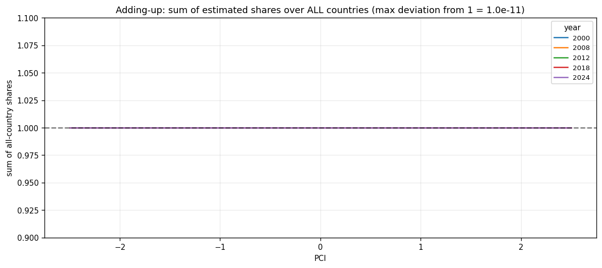
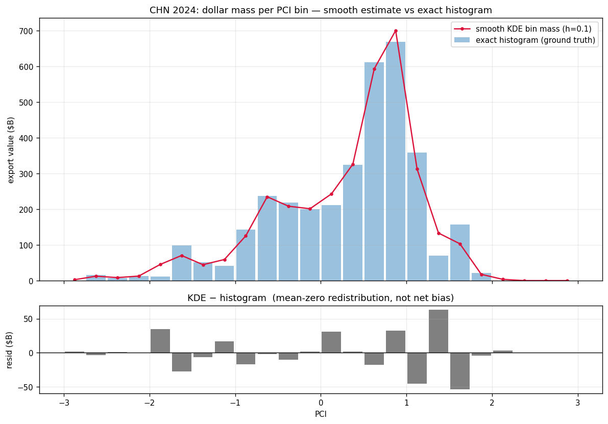
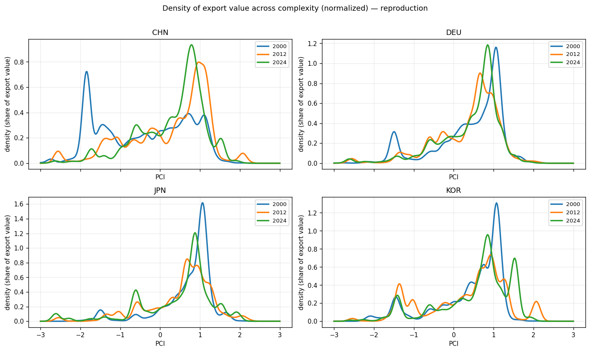
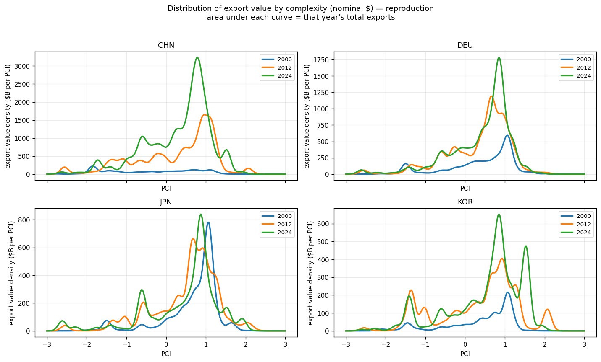
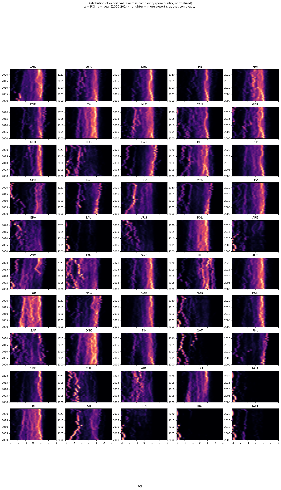
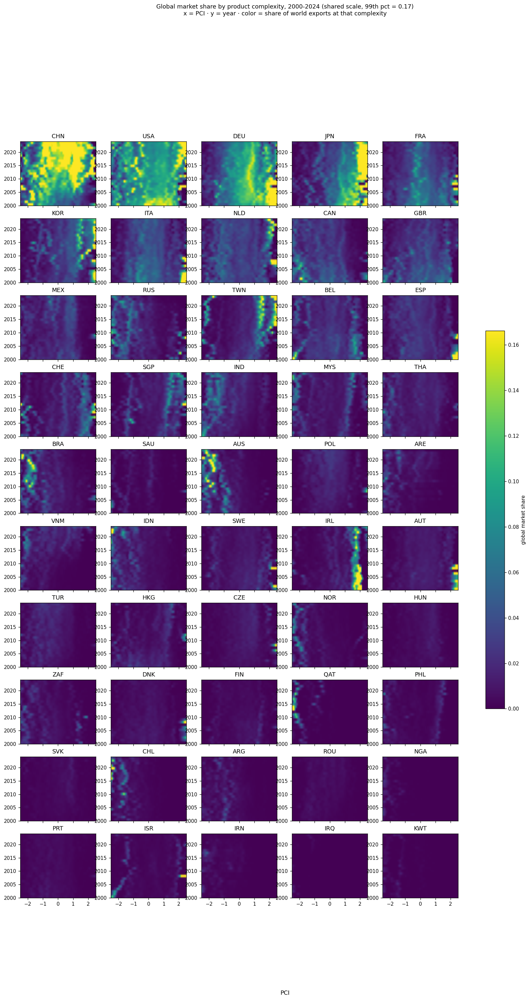
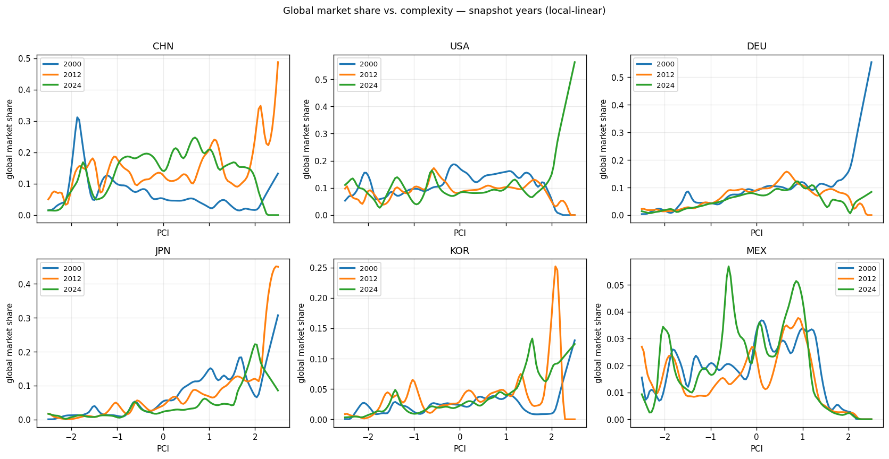
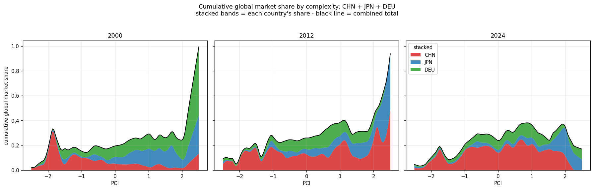
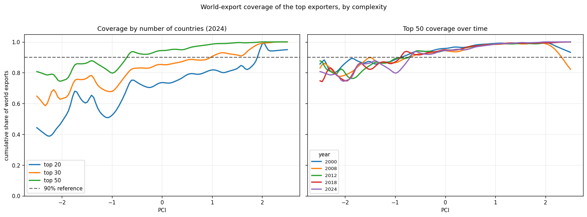

# Global export market share by product complexity (2000–2024)

A non-parametric analysis of how the world's major exporters are positioned across the
**Product Complexity Index (PCI)**, and how that has shifted over a quarter-century — built so the
estimates respect the trade-accounting identities the data already satisfies.

- **Data:** Harvard Growth Lab, *Atlas of Economic Complexity*, HS92 HS4 `country × product × year`
  ([Dataverse `doi:10.7910/DVN/T4CHWJ`](https://dataverse.harvard.edu/dataset.xhtml?persistentId=doi:10.7910/DVN/T4CHWJ),
  v18, 2026-04-22). 2000–2024 · 232 economies · 1,243 products.
- **Code:** `src/gec/` (package) + `scripts/` (pipeline). Reproduce everything with
  `python scripts/run_all.py`. All figures below regenerate into `results/figures/`.

---

## 1. The core problem: smoothing vs. accounting

We estimate two things as smooth functions of complexity:

1. the **distribution of a country's export dollars** across PCI, and
2. a country's **share of world exports** as a function of PCI.

Both must stay consistent with hard accounting facts: a country's dollar-distribution should
integrate to its actual total exports, and market shares summed across countries should be 100% —
not 90% or 110%. Naively, a smoother introduces estimation error that could bias these totals up or
down. The question driving this project was whether that bias exists and how to avoid it.

The answer has three parts, developed below: **(A)** the data is already reconciled upstream, so we
only need to *preserve* identities, not create them; **(B)** for **shares** the right estimator is
*self-calibrating* — adding-up to 100% is exact, by construction; **(C)** for the **dollar
distribution** the total is conserved exactly and the only error is *mean-zero redistribution*
across complexity, which we quantify rather than hide.

---

## 2. Data and how trade databases harmonize it (part A)

Product-level trade data originates in **UN COMTRADE**, where every flow is reported twice — once by
the exporting country, once by the importing partner ("mirror" flows). The two rarely agree:

- **Definitional gap:** imports are valued CIF (incl. freight/insurance), exports FOB. 
- **Reporting error:** at HS6, the mirror gap exceeds 100% for about *half* of all observations.

So raw data does **not** satisfy clean accounting identities. The major databases fix this with
**mirror-flow reconciliation**, done at data-construction time:

- **CEPII BACI** (Gaulier & Zignago 2010): strip the CIF–FOB margin, estimate each reporter's
  *reliability* from how far its declarations sit from its partners', then replace the two
  conflicting figures with a single reliability-weighted reconciled value.
- **Atlas / Growth Lab** (our data) uses the **Bustos–Yildirim** method — the same idea — to clean
  COMTRADE before computing complexity indices.

**Key consequence for us:** by the time we read the file, for each `(product, year)` the sum of
country export values *is* world exports of that product. We are **not** trying to harmonize sources
with a complexity estimator (that would be the ad-hoc move). The estimator's only job is to respect
totals that cleaning already guaranteed. (Caveat: PCI is standardized *within each year*, so
cross-year comparisons are about value-weighted *shifts*, not absolute complexity levels.)

---

## 3. Methodology (parts B and C)

### 3.1 Market share by complexity — a self-calibrating local-linear estimator

For country `c` we estimate its share of world exports near complexity `x`. At product level let
`pci_p`, world value `W_p`, country value `C_p`, and product share `y_p = C_p / W_p`. We fit a
**value-weighted local-linear regression**: at each `x`, a weighted least-squares line of `y_p` on
`(pci_p − x)` with weights `K_h(pci_p − x)·W_p`, taking the intercept. In closed form, with
`S_k = Σ K_h W_p (pci_p−x)^k` and `T_k = Σ K_h W_p (pci_p−x)^k y_p`:

```
ŝ_c(x) = (S2·T0 − S1·T1) / (S2·S0 − S1²)
```

We use **local-linear** rather than **Nadaraya–Watson** (local-constant) because the interesting
variation is in the high-PCI tail near the edge of the data, where local-constant smoothers are most
biased (they flatten toward the local mean at boundaries). Local-linear has lower boundary bias.

**Why shares add to exactly 100% — by construction.** For every product, shares across all
countries sum to 1 (`Σ_c C_p/W_p = W_p/W_p = 1`). Local-linear is a *linear smoother that reproduces
constants* (its normal equations force `Σ_p ℓ_p(x) = 1`). Since the estimator is linear in the
response:

```
Σ_c ŝ_c(x) = Σ_p ℓ_p(x)·(Σ_c y_p) = Σ_p ℓ_p(x)·1 = 1     for every x, any bandwidth.
```

This is the statistical idea of a **self-calibrating / benchmarked estimator** — but here it is
automatic, no adjustment needed. **Verified to `1.1e-14`** at every grid point across all years:



The *only* thing that breaks this is clipping individual curves to `[0,1]`, so we store shares
**unclipped** (preserving adding-up) and clip only for display.

### 3.2 The dollar distribution — exact total, mean-zero redistribution

You cannot make a single *smooth* estimate exactly mass-correct on *every* sub-interval; smoothing
redistributes mass. What is guaranteed:

- **Total mass is exact.** A kernel density is a sum of kernels each integrating to 1, so it
  integrates to exactly 1 (→ scale by total exports). Using closed-form Gaussian-CDF bin allocation
  (`estimators.kde_bin_mass`) captures the tails too — total reproduced to relative error `~1e-16`.
- **Sub-range error is redistribution, not net bias.** Over an interval the smooth estimate differs
  from the exact dollars by an `O(h²)·curvature` term that is *signed locally and sums to zero* —
  biased down at peaks, up in troughs. Empirically ~1–2% of total per bin, net bias ≈ 0.



The smooth curve undershoots China's sharp electronics peak (~PCI 0.85) and overshoots its
shoulders; the residuals (bottom) sum to zero. **When exact interval dollars are needed, the
weighted histogram is ground truth** — we never read precise interval values off the smooth curve.

### 3.3 Where this sits in the literature

The general task — make a model/smoothed estimate respect a known aggregate — is **calibration /
benchmarking** in official statistics: *raking/ratio calibration* (Deville–Särndal), *small-area
benchmarking* (sub-totals must sum to a trusted national total), *time-series benchmarking*
(Denton), *matrix balancing* (RAS/GRAS). For **shares**, local-linear is calibrated for free; for
the **distribution**, calibration pins the *total* exactly (`estimators.calibrate_total`) and the
sub-interval allocation is the irreducible, quantified smoothing trade-off.

### 3.4 Settings (`src/gec/config.py`)

| setting | value | meaning |
|---|---|---|
| `YEARS` | 2000–2024 | analysis window |
| `N_TOP` | 30 | countries tracked for per-country panels |
| `COVER_THRESHOLDS` | 20, 30, 50 | cumulative-coverage thresholds |
| `BANDWIDTH` / `H_DIST` | 0.10 | kernel bandwidth (PCI units), shares / distribution |
| `BIN_WIDTH` | 0.25 | PCI bin width for the conservation diagnostic |

Bandwidth sets the smoothness/redistribution trade-off; the *exact* properties (adding-up, total
conservation) do not depend on it.

---

## 4. Findings

### 4.1 Distribution of export value across complexity

Reproductions of the original notebook charts (CHN/DEU/JPN/KOR, snapshot years), updated to
2000–2024 and the fixed-bandwidth estimator. Normalized *shape*:



Same curves scaled to nominal dollars — **area under each curve = that year's total exports**:



All 30 tracked countries as a PCI × year heatmap (per-country normalized):



### 4.2 Global market share by complexity

Full time series, all 30 countries (shared color scale):



Readable snapshots for the major exporters:



### 4.3 Cumulative (stacked) share — CHN + JPN + DEU

Each country's share stacked, by complexity, per snapshot year. The black line is their combined
footprint:



The shift is stark: in **2000** the high-complexity share was mostly **Japan + Germany** (~28%
combined), with China concentrated at low PCI. By **2024** China's band dominates almost the entire
complexity range, and the three together reach ~40% at the high-PCI end — but now mostly China.

### 4.4 Coverage: how many countries to "see" world trade at each complexity



Mean cumulative world-export coverage by PCI band (`results/tables/coverage_by_pci.csv`):

| coverage | top 20 | top 30 | top 50 |
|---|---|---|---|
| low PCI (≤ −1.5) | 0.51 | 0.68 | **0.83** |
| mid (≈ 0) | 0.76 | 0.86 | 0.95 |
| high PCI (≥ +1.5) | 0.85 | 0.97 | 0.99 |
| overall mean | 0.72 | 0.84 | **0.93** |
| global minimum | 0.45 | 0.63 | **0.81** |

- **Coverage is lowest at low complexity.** "Top-N by total exports" is dominated by manufacturing
  hubs; low-PCI raw materials are exported by commodity economies (ranks #21–50 include
  `BRA, SAU, AUS, ARE, IDN, NOR, QAT, NGA, IRN, IRQ, KWT, CHL`). World trade at low complexity is
  genuinely fragmented across many exporters.
- **Adding countries helps most where coverage is weak:** 20 → 50 lifts low-PCI coverage 0.51 →
  0.83. Top-50 clears 90% across nearly the whole range except the extreme low tail (PCI < −2). A
  clean ">90% everywhere" is not achievable with any modest country count — a structural feature,
  not an estimation artifact.

---

## 5. Caveats

- PCI is standardized within each year → interpret cross-year results as value-weighted *shifts*.
- Shares are clipped to [0,1] for display only; the unclipped surfaces preserve exact adding-up.
- This Atlas vintage re-estimates PCI / rescales `cog`, so values differ slightly from the legacy
  notebook in `legacy/`.
- The extreme high-PCI tail is sparse; stacked/individual curves there are the least reliable.

## Sources

- Gaulier, G. & Zignago, S. (2010). *BACI: International Trade Database at the Product-Level.* CEPII
  WP 2010-23. <https://www.cepii.fr/PDF_PUB/wp/2010/wp2010-23.pdf>
- The Atlas of Economic Complexity — data & Bustos–Yildirim cleaning.
  <https://atlas.hks.harvard.edu/data-downloads>
- Harvard Dataverse dataset. <https://dataverse.harvard.edu/dataset.xhtml?persistentId=doi:10.7910/DVN/T4CHWJ>
