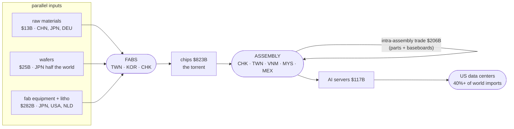
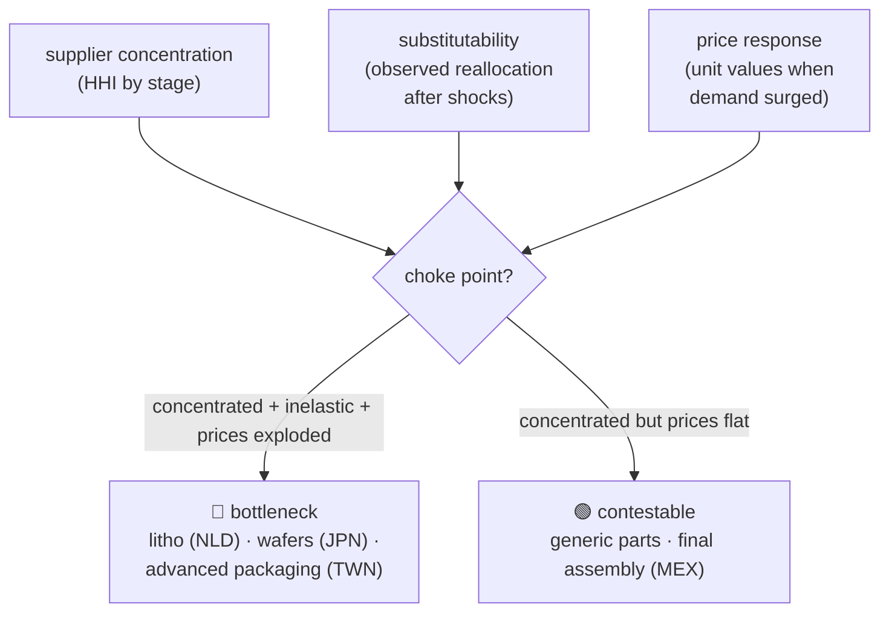

# The AI Supply Chain, Measured
### A monthly, model-based map of the global semiconductor trade network — and what it says about power, prices, and policy

*Companion sketch to [research-proposal.md](../research-proposal.md); designed to be read in five minutes.*

---

## The pitch in one paragraph

The hardware behind AI was re-sourced, re-priced, and re-routed between 2023 and
2026 — and the standard research data, annual and years-stale, missed all of it.
We built the missing instrument: a balanced **monthly** bilateral trade panel for
AI-compute goods, current to within ~3 months, plus a **dynamic factor model** that
compresses the network into interpretable hubs and dates exactly when its structure
broke. On top of it, a measurement program: who gained, what got scarce, which
policies actually changed the network's shape — and which only looked like they did.

---

## The system we measure

*2024 flows, China+Hong Kong merged. Design/IP — the largest value input — never
crosses a border as goods: that asymmetry is a finding, not an omission.*

---

## What is already built

| asset | one-line description | state |
|---|---|---|
| **Monthly panel** | 30 countries + ROW, 3 compute codes, 2020 → ~now; Comtrade + TDM, mirror-reconciled, provenance per cell; validates 0.94–0.95 vs the annual benchmark | ✅ |
| **Dynamic factor model** | time-varying hubs + hub-to-hub flows; era-anchored labels; bloc variants (CHN+HK, US+MEX) that decompose change by level | ✅ |
| **Break chronology** | structure static through 2022 → **2023-07** (H100 ramp: a Taiwan factor is born) → **2025-04** (tariffs: the only *policy* break; a Singapore rerouting factor appears) | ✅ |
| **Chain map + visuals** | 8-stage HS6 taxonomy (OECD/Fed), staged flow charts, hub-routed charts, country-network graph | ✅ |
| **Narrative record** | year-by-year 2021–26, every number traceable to the panel | ✅ |

**Three headline facts the instrument has already produced:**

1. **A five-year pole swap.** Taiwan: 10.5% → 33.7% of world exports in the compute
   codes. China: 28.2% → 11.8%. Almost perfectly symmetric.
2. **The boom is a price story.** Taiwan baseboard exports: ~$285/kg (2022) →
   ~$5,900/kg (2026). Same boxes, 20x the value. Volume metrics miss the era.
3. **Controls vs tariffs leave opposite fingerprints.** Export controls: *no*
   structural break — denied growth (China import share 13.6% → 9.8%) and rerouting
   inside the China bloc. Tariffs: the one break that survives every aggregation,
   entangling the China and US blocs and birthing a Singapore hub.

---

## The questions, and how each is answered

**1 · Terms of trade, by country over time** —
export vs import unit-value indices per stage from customs quantities (already
pulled). Taiwan's export prices 20x'd while its input prices didn't: the largest
terms-of-trade gain in modern trade data, quantified monthly.

**2 · Which linkages intensified** —
corridor growth (TWN→USA 15x; TWN→MEX 6x in one year), the hub-to-hub flow matrix,
and a drift statistic that *dates* every reorganization. Built.

**3 · Concentration, centrality, substitutability** —
per-stage HHIs and network centrality over time; substitutability read from
observed substitution episodes (the China→Taiwan swap; post-shock reallocation
speed). Mechanical on the panel.

**4 · Fragmentation from policy** —
within-bloc vs cross-bloc trade shares around the dated breaks; the
controls-vs-tariffs signature contrast above is the core result, to be formalized
into indices.

**5 · US vs China AI investment, by stage** —
read each country's *imports* as revealed investment: China is the world's largest
buyer of fab equipment (**upstream capacity**, $79B in 2024); the US absorbs 40%+
of finished compute (**downstream deployment**). Rates and supplier-diversification
trends complete the comparison.

---

## The flagship synthesis: an evidence-based choke-point map

Concentration alone is not a bottleneck — concentration **plus inelasticity** is,
and inelasticity reveals itself in prices. The stages whose prices exploded under
the demand surge are precisely the ones that could not add capacity or be
substituted. Our unit-value data ranks stages by that response; crossing it with
concentration yields a choke-point map that is *measured*, not asserted.

---

## Roadmap

| step | what | unlocks |
|---|---|---|
| 1 | network-statistics module (HHI, centrality, fragmentation) | questions 3–4 formalized |
| 2 | unit-value / terms-of-trade indices | question 1; the price half of choke points |
| 3 | **chips-stage monthly panel** (one code-list change) | the upstream choke-point map; the export-control battlefield |
| 4 | value-added layer (mini-TiVA absorption accounting) | corrects gross-flow importance into value importance — the Mexico-vs-Taiwan correction |
| 5 | semi-structural model (capacity constraints + substitution; unit-value responses as identification) | counterfactuals — **the open ambition** |

---

## Honesty box

Customs data counts every border crossing (double counting), inflates entrepôts,
cannot see inside countries (Mexico: chips in, servers out), and never sees IP.
Our design quarantines this: the measurement layer is assumption-light and stands
alone; value-added corrections and replaceability claims import stated assumptions
and labeled judgments. Where a number depends on a choice, the choice is written
down next to it.
