# The AI-compute supply chain, 2021–2026: what moved, and what the trade data shows

An anecdotal but number-anchored account of how the hardware supply chain behind AI
data centers evolved, told alongside our own monthly panel (HS 847150 servers,
847180 baseboards, 847330 parts/cards; results/panel_monthly). Dollar figures are
from the panel unless noted; industry events from the public record. Written 2026-07.

## The chain itself: stages, products, sizes, places

Before the story, the map. The stage definitions and HS6 code lists come from the
OECD's *Mapping the semiconductor value chain* (2025, doi:10.1787/4154cdbf-en) and
the Fed's AI-compute basket (FEDS Note, 2026-02-13), as pinned down in
[tech-ai-taxonomy.md](tech-ai-taxonomy.md); the dollar sizes and corridors are from
our own bilateral data (2024, HS2012 files; the three panel codes also from the
monthly panel). The whole traded chain was ~$1.66T in 2024, more than half of it
the chips stage.

| # | stage | key HS6 codes | 2024 trade | who exports → who imports |
|---|---|---|---|---|
| 1 | Raw materials: polysilicon, rare gases, gallium/germanium, specialty chemicals | 280461, 280421/29, 282560, 811292/99 | part of ~$143B (stages 1–2 + optics inputs) | China (Ga/Ge ~90%/60%, polysilicon), Germany/US (polysilicon), Japan (gases, photoresists) → fab countries |
| 2 | Wafers and wafer inputs | 381800 (doped wafers), 3701xx/370790 (photo plates & chemicals) | — (in the $143B above) | Japan (Shin-Etsu, SUMCO — half the world's wafers), Taiwan, Germany, Korea → Taiwan/Korea fabs |
| 3 | Fab equipment & lithography optics | 8486xx, 9001xx/9002xx, 901210/90, 903141, 903082/84 | **$249B** | Japan 14%, US 13%, Netherlands 10% (ASML), Germany 8% → **China 23%** (Japan→China $16B, NL→China $9B), Taiwan, Korea |
| 4 | Chips: logic, memory (incl. HBM), discretes, IC parts | 854231/32/33/39/90, 8541xx, 852351/52/59 | **$926B — 56% of the chain** | Taiwan 19%, China 17%, Korea 14% (memory/HBM), Singapore 10%, Malaysia 9% (packaging/test) → the China sphere absorbs 43% (China→HK $72B, Taiwan→China $52B, Korea→China $45B) |
| 5 | Parts, boards, GPU cards/modules | **847330** (+ bare PCBs 853400) | $151B | China-led in tonnage; the high-value AI slice from Taiwan (CoWoS-packaged modules) → US, Mexico, everywhere |
| 6 | Baseboards / subassemblies (HGX trays) | **847180** | $83B | Taiwan dominant (~2x China) → US, Mexico |
| 7 | Finished AI servers | **847150** | $122B (→$262B in 2025) | Mexico and Taiwan → the US, which absorbs ~40% of world imports of the compute codes |
| 8 | The rest of the data center: switches, optics, power, storage | 851762/851770, 854470/900110, 850440, 847170, 853400 | ~$450B (Tier B basket) | China, Mexico, Malaysia, Thailand → US and everywhere |

The same map as flow charts (`exports/supply_chain_*_2024.png`, regenerate with
`python scripts/export_supply_chain_sankey.py`): a multi-column overview of all
eight stages in two scale versions (dollar — nominally comparable widths
everywhere; normalized — stages equalized, shares only; a log version was tried
and retired: log of stage totals wholesale-inflates small, Other-dominated
stages), plus one four-column chart per stage
routing the flows through factor-model hubs (exporters -> export hubs -> import
hubs -> importers; TV-MFM hubs for the three compute codes, annual
constant-loading MFM upstream; hub decompositions fit at R^2 0.95-0.99, so
these carry the flows faithfully).

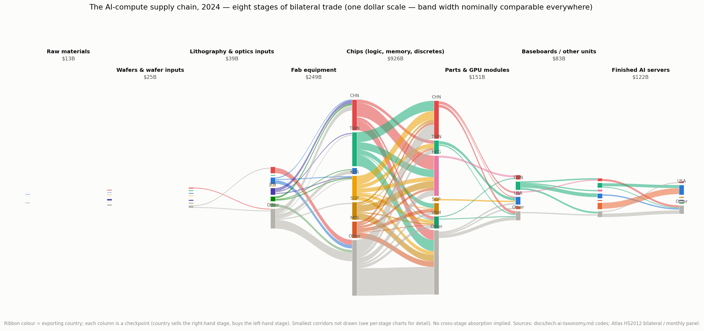
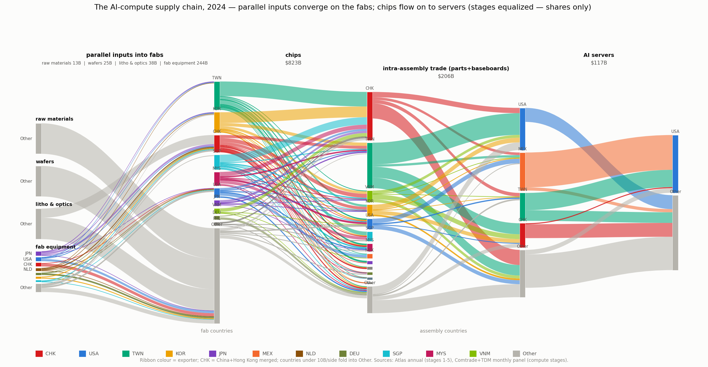
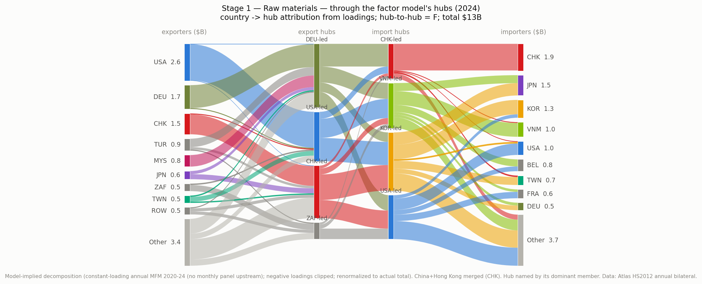
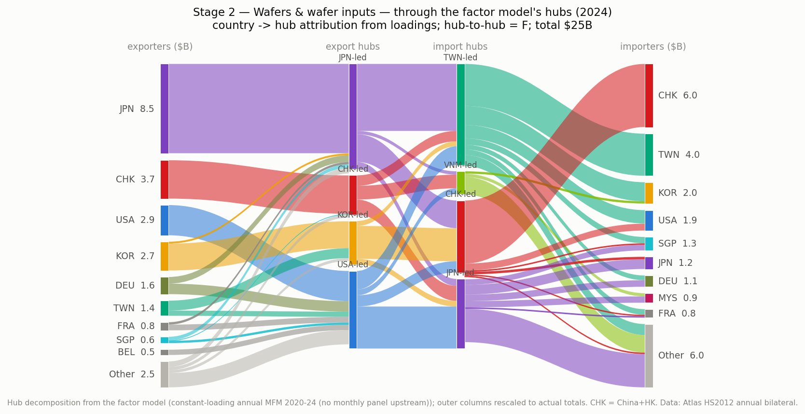
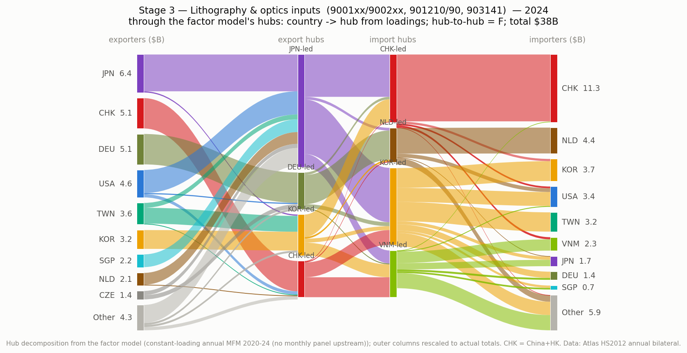
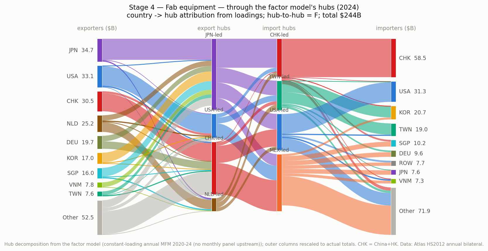
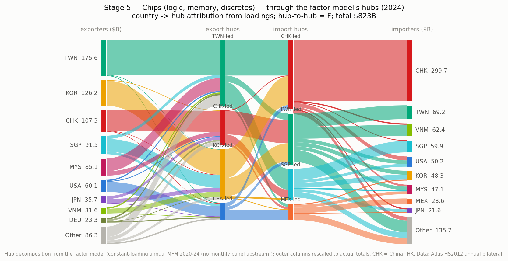
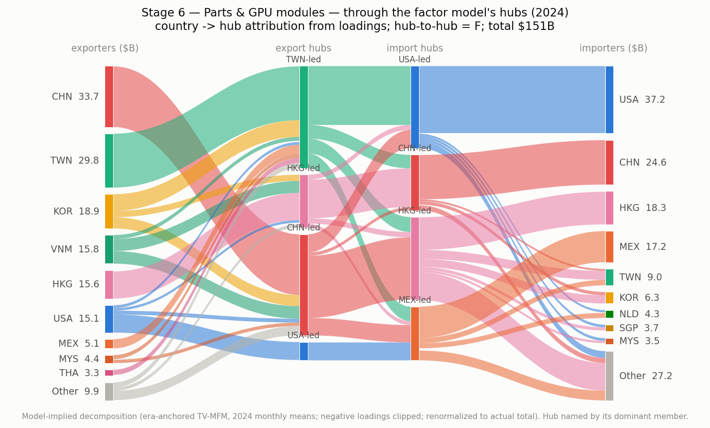
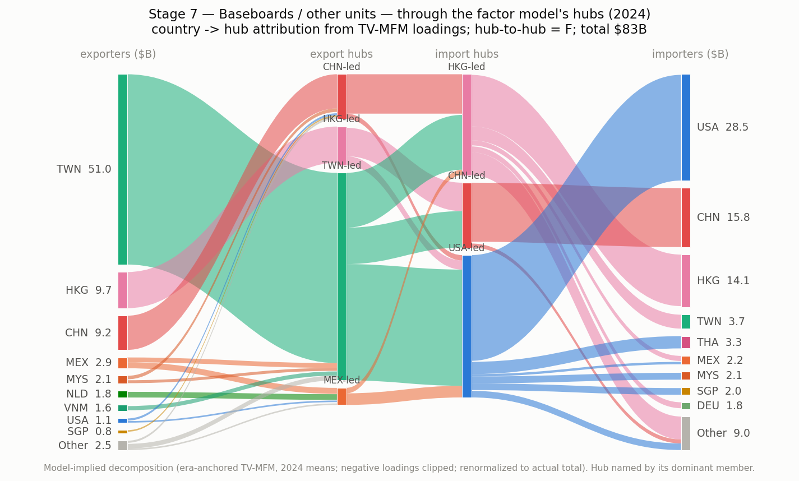
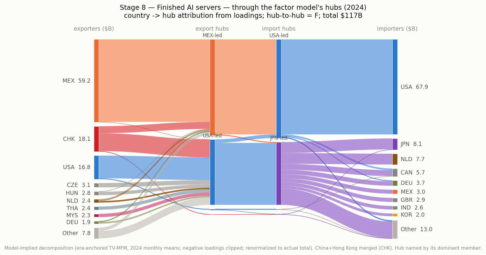
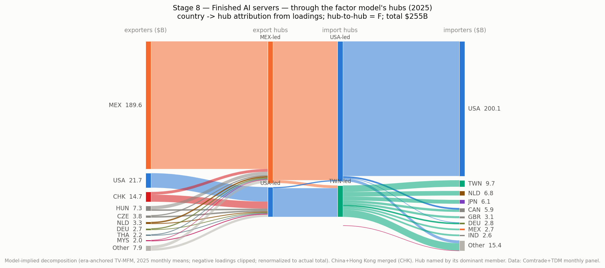

All charts merge China+Hong Kong (CHK; intra-bloc flows excluded). Stages 1-5 are
Atlas HS2012 annual bilateral data (ends 2024); stages 6-8 are the Comtrade+TDM
monthly panel, which also provides 2025 versions of those three charts.

Two facts about this map shape everything downstream. First, **each stage lives in
different countries**, so the chain *is* a sequence of border crossings: Japanese
wafers and Dutch machines into Taiwanese fabs; Taiwanese chips into Korean-memory-
laden modules; modules into Mexican assembly; servers into US data centers — with
design value (Nvidia, USA) never appearing in goods trade at all. Second, **our
monthly panel covers stages 5–7 only** — the final, most double-counted segment;
the chips stage (4), where the export-control battle is fought, is the natural
extension.

## The starting point: a PC-era network (2020–2021)

Before the boom, these three product codes described the personal-computer and
ordinary-server industry. The network had a settled shape: China made and shipped
parts (28% of world exports in these codes in 2020, $110B+ of it in 847330 alone),
Hong Kong churned re-exports both directions, Taiwan supplied components (a 10.5%
share — respectable, unremarkable), and Mexico assembled ordinary servers for the
US market (~$21–23B/yr northbound). 2021 was a big year for the *old* network:
pandemic demand for PCs, the crypto-mining GPU boom, and shortage-driven
double-ordering pushed totals up (~$232B across the three codes). The stress of
2021 was logistics — chip shortages, port congestion — not structure. Our factor
model agrees: loading drift through this whole period is near zero.

## 2022: pressure without transformation

Three things happened that would matter later, none of which moved the trade data
much at the time: the Shanghai lockdowns (spring) rattled electronics assembly and
accelerated "China+1" plans; the US CHIPS Act passed (August); and on October 7 the
US imposed its first sweeping export controls on advanced chips to China. Meanwhile
the PC boom deflated and crypto mining died (Ethereum's September merge). Totals
plateaued (~$249B). The network's shape still didn't change — drift stayed flat.

## 2023: the pivot year — smaller totals, different contents

The strangest year in the data. Total trade in these codes *fell* (to ~$229B;
847330 dropped from $134B to $108B) because the PC slump was still deflating the
old network. But underneath, the composition flipped:

- **November 2022**: ChatGPT. **May 24, 2023**: Nvidia's earnings guidance ~50%
  above expectations — the moment AI demand became hardware orders.
- **July 2023**: the orders became shipments. H100 modules and HGX baseboards began
  leaving Taiwan in volume; TSMC used its July earnings call to announce a doubling
  of CoWoS advanced-packaging capacity; by September its chairman called CoWoS "the
  shortage." Our factor model dates its largest structural break to exactly this
  month: Taiwan's export behavior separates from the rest of Asia.
- The same month, China restricted gallium/germanium exports (July 3), and in
  October the US banned the China-market H800/A800 chips.

The clearest fingerprint is not value but *price*: Taiwan's baseboard exports
(847180) jumped from ~$285/kg in 2022 to ~$1,500/kg in 2023 — same kind of boxes,
five times the value per kilogram. AI hardware was replacing PC hardware inside the
same customs categories. Taiwan's world export share jumped from 12.8% to 20.4% in
a single year while China's slid from 26% to 23%.

## 2024: scale-up

The first full year of the AI-hardware economy: totals up ~55% to $356B, led by
servers (847150: $74B → $122B) and baseboards ($46B → $83B). Blackwell was announced
in March and ramped late in the year through the same packaging bottleneck. The
corridor build-out is visible line by line:

- Taiwan → USA more than doubled ($23B → $49B).
- Taiwan → Mexico doubled ($1.7B → $3.8B): baseboards feeding Mexican final
  assembly, which sent $36B of finished servers north.
- Vietnam and Malaysia grew as secondary assembly (VNM → USA doubled to $4.6B).
- China's *direct* exports to the US stayed flat (~$7B) — its share of world
  exports fell to 16.8% while Taiwan's reached 26.7%. The two lines crossed.

December brought tighter US controls (HBM) and China's retaliatory hard ban on
gallium/germanium to the US.

## 2025: the policy year — and the blow-off in values

Totals up another ~75% to $628B. Every corridor in the AI chain exploded: Taiwan →
USA hit $127B (15x its 2020 level), Taiwan → Mexico $22B (6x in one year), Mexico →
USA $77B, parts southbound USA → Mexico $16B. And policy finally became a
structural force:

- **April 2025**: the tariff shock (announced April 2, electronics partially
  exempted days later amid confusion) plus the H20 export ban. Our model finds its
  only bloc-level structural break here — the China-bloc and US-bloc export factors
  became entangled, and a **new Singapore-led factor appeared** from nowhere.
  The raw data concurs: Singapore → USA, flat at ~$0.6B for five years, jumped to
  $3.0B, amid public smuggling crackdowns and rerouting scrutiny of Singapore and
  Malaysia. (The H20 was partially re-allowed mid-year under a revenue-sharing
  arrangement.)
- Onshoring became real money: TSMC's Arizona commitment grew toward $265B; server
  assembly plants opened in Texas. Late in the year, rack-scale systems (NVL72)
  began changing what physically crosses borders at all.
- Taiwan's share of world exports in these codes reached **33.7% — almost exactly
  the 28% China held in 2020, with China down to 11.8%**. A five-year swap of the
  two poles of the network.

## 2026 so far: still accelerating

January–April alone: $330B across the codes (~$990B annualized). Taiwan's exports
to the US are running at ~$180B/yr pace; its overall trade surplus with the US
topped $100B in a half-year for the first time, feeding tariff tension. Unit values
keep climbing (Taiwan baseboards near $5,900/kg — 20x 2022). Hong Kong's relative
role keeps fading (9.5% of world exports in 2020, 5.7% now). China's direct
shipments to the US in these codes are down to a ~$8B/yr trickle.

## The five-year shift in one table

Share of world exports, all three codes:

| exporter | 2020 | 2023 | 2025 | direction |
|---|---|---|---|---|
| China | 28.2% | 23.0% | 11.8% | halved — the old parts hegemon |
| Taiwan | 10.5% | 20.4% | 33.7% | tripled — the new pole |
| Mexico | 12.1% | 11.1% | 14.0% | steady conduit, bigger pipe |
| Hong Kong | 9.5% | 8.2% | 6.1% | fading entrepot |
| Vietnam | 2.0% | 5.0% | 6.0% | tripled from a low base |
| Singapore | 2.6% | 2.3% | 4.0% | flat, then the 2025 jump |

## Value vs volume: mostly a price story

Taiwan's export unit values ($/kg, TDM customs data):

| code | 2020 | 2022 | 2023 | 2025 | 2026 |
|---|---|---|---|---|---|
| 847150 servers | 262 | 360 | 765 | 1,678 | 1,849 |
| 847180 baseboards | 111 | 285 | 1,514 | 3,646 | 5,877 |
| 847330 parts | 171 | 204 | 195 | 280 | 242 |

The dollar explosion is overwhelmingly about what is *inside* the boxes, not how
many boxes. Baseboard value-per-kilogram rose ~20x from 2022 to 2026; parts stayed
almost flat until 2025 (generic PC components still dominate that code's tonnage).
Any volume-based reading of this trade (weight, containers) misses most of the
story; any value-based reading overstates physical reorganization.

## What the two policy regimes did — and how differently they show up

The export controls and the tariffs left completely different marks on the data,
and the factor model separates them cleanly.

**The chip export controls (October 2022, October 2023, December 2024) never
changed the shape of this network.** The model finds no structural break at any
control date, and China's export hub keeps its identity (similarity ~0.99)
straight through all of them. What the controls did instead was *deny China the
boom*: China's imports of these codes kept growing in ordinary dollars ($27B in
2023 to $62B in 2025 — compliant chips and ordinary components) but its share of
world imports fell from 13.6% to 9.8% while the US share climbed past 40%. The
US bought five times more in 2025 than in 2020; China barely two. The controls
also left routing fingerprints — Taiwan-to-China doubled in 2024 (the
compliant-variant module trade), Hong Kong re-exports into China climbed to $27B
— but the bloc-merged model shows these net out inside the China bloc: routes
moved within the wall, the wall itself did not move. One caveat: the controls'
real battlefield is bare chips (HS 8542.31), a layer this panel does not yet
cover; there the story could differ.

**The April 2025 tariffs are the one policy event the structure registers** — an
era break in every model configuration, including the strictest (both blocs
merged), where it is the *only* break in six years. Its anatomy: the China-bloc
and US-bloc export patterns became entangled (they started moving together — the
signature of a common policy shock), and a brand-new Singapore export factor
appeared from nowhere, matching the corridor data (Singapore to US: ~$0.6B for
five straight years, then $3.0B in 2025, amid rerouting scrutiny). Yet the
tariffs did not cut volumes — exemptions kept the Taiwan and Mexico corridors
booming. Their effect was on *which routes exist and who co-moves*, not on how
much flows.

The general lesson: gradual, targeted policy (controls) bends trajectories and
shows up in levels and shares; sudden, broad policy (tariffs) breaks structure
and shows up as reorganization. A factor model is a break-detector for the
second kind and only a trend-reader for the first.

## How to read all of this (the standing caveats)

Gross shipments still double-count the chain (a Taiwan board is re-counted inside a
Mexican server), re-exports still inflate entrepots, and the biggest value slice —
US chip design — never appears in goods trade at all. The Mexico-vs-Taiwan contrast
runs through every year above: Mexico's numbers grew because more value passes
*through* it; Taiwan's grew because more value is *created* there. See
docs/modeling-brainstorm.md for what we intend to do about that distinction.
