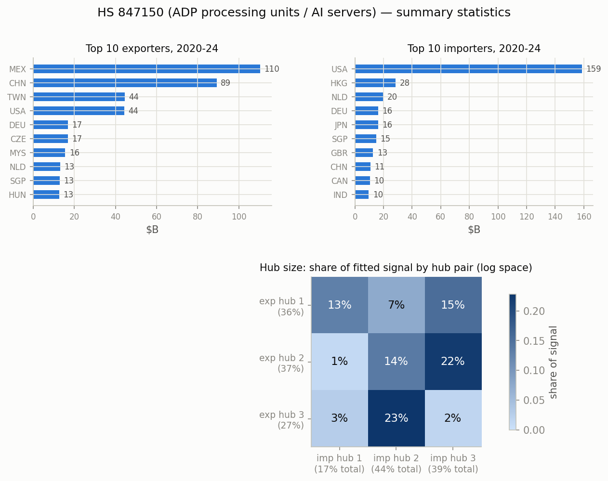
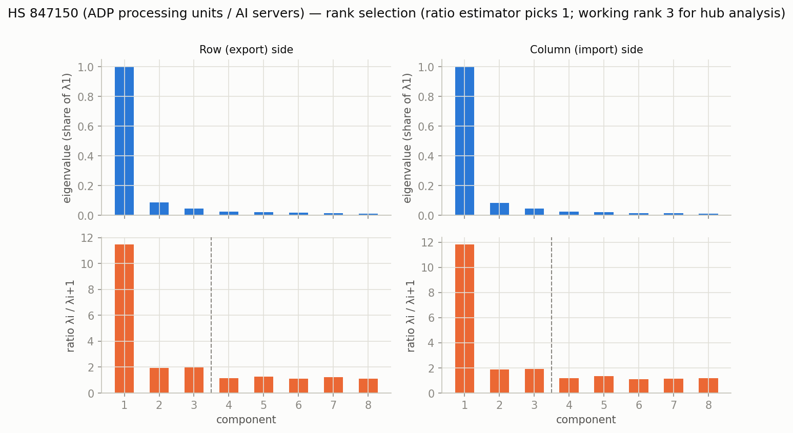
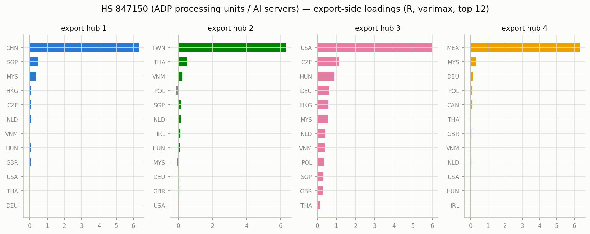
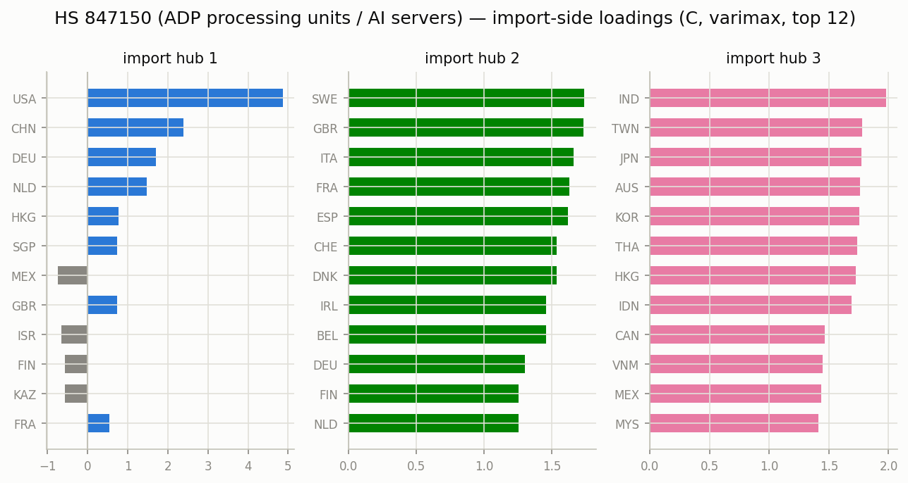
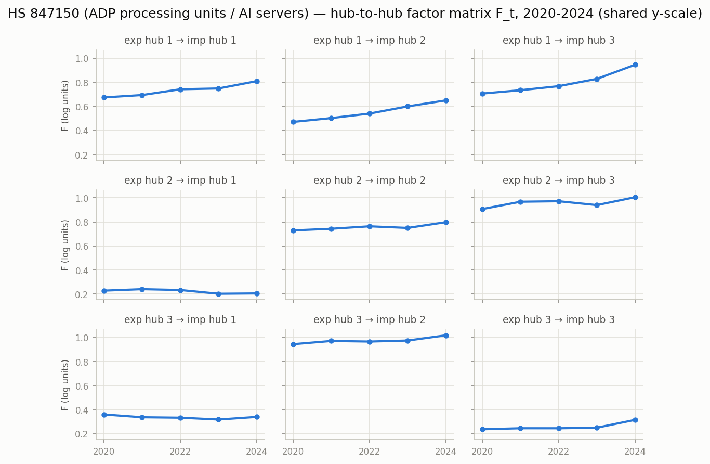

# HS 847150 (ADP processing units / AI servers) — matrix factor model, 2020-2024

Constant-loading matrix factor model `Y_t = R F_t C' + E_t` on annual bilateral
log1p export matrices (Atlas HS2012 bilateral data), top 40 countries
covering 94.6% of $429B world trade.
Estimation per Chen, Chen, Bolivar & Chen (2024), `docs/references/`; varimax
rotation on each side; hub size = share of fitted signal (exact under the
orthonormal-loading decomposition, log space — not dollar shares).

- **Rank:** eigenvalue-ratio estimator picks 1 (the dominant
  gravity/size factor); working rank for hub analysis k=3, r=3 (2nd ratio peak).
- **Fit:** uncentered R^2 0.855 (rank-1 baseline 0.757).

## Top traders, 2020-2024 ($B)

| # | exporter | $B | importer | $B |
|---|---|---:|---|---:|
| 1 | MEX | 110.4 | USA | 158.7 |
| 2 | CHN | 89.3 | HKG | 28.5 |
| 3 | TWN | 44.5 | NLD | 19.6 |
| 4 | USA | 44.3 | DEU | 16.3 |
| 5 | DEU | 16.9 | JPN | 16.1 |
| 6 | CZE | 16.8 | SGP | 14.9 |
| 7 | MYS | 15.6 | GBR | 12.7 |
| 8 | NLD | 13.2 | CHN | 10.8 |
| 9 | SGP | 12.8 | CAN | 10.5 |
| 10 | HUN | 12.6 | IND | 9.7 |

## Hub structure

Export-hub sizes: hub 1 36%, hub 2 37%, hub 3 27%.
Import-hub sizes: hub 1 17%, hub 2 44%, hub 3 39%.

Share of fitted signal by hub pair (rows = export hub, cols = import hub):

| | imp 1 | imp 2 | imp 3 |
|---|---|---|---|
| exp 1 | 13% | 7% | 15% |
| exp 2 | 1% | 14% | 22% |
| exp 3 | 3% | 23% | 2% |

### Export hubs (varimax loadings, top 8)

- **hub 1** (36%): TWN +2.62, MEX +2.20, MYS +2.10, SGP +1.89, THA +1.67, CAN +1.54, VNM +1.43, ISR +1.33
- **hub 2** (37%): CHN +3.74, USA +3.57, HKG +1.86, SGP +1.28, DEU +1.28, NLD +1.22, MYS +1.08, THA -0.88
- **hub 3** (27%): CZE +3.44, HUN +2.48, DEU +2.08, NLD +1.68, MYS -1.50, SGP -1.48, POL +1.27, GBR +1.10

### Import hubs (varimax loadings, top 8)

- **hub 1** (17%): USA +4.87, CHN +2.40, DEU +1.70, NLD +1.48, HKG +0.77, SGP +0.74, MEX -0.74, GBR +0.73
- **hub 2** (44%): SWE +1.74, GBR +1.73, ITA +1.66, FRA +1.63, ESP +1.62, CHE +1.54, DNK +1.53, IRL +1.46
- **hub 3** (39%): IND +1.98, TWN +1.78, JPN +1.77, AUS +1.76, KOR +1.76, THA +1.73, HKG +1.73, IDN +1.69

## Figures

_Generated by `scripts/prototype_mfm.py`; full numbers in `stats.json`._