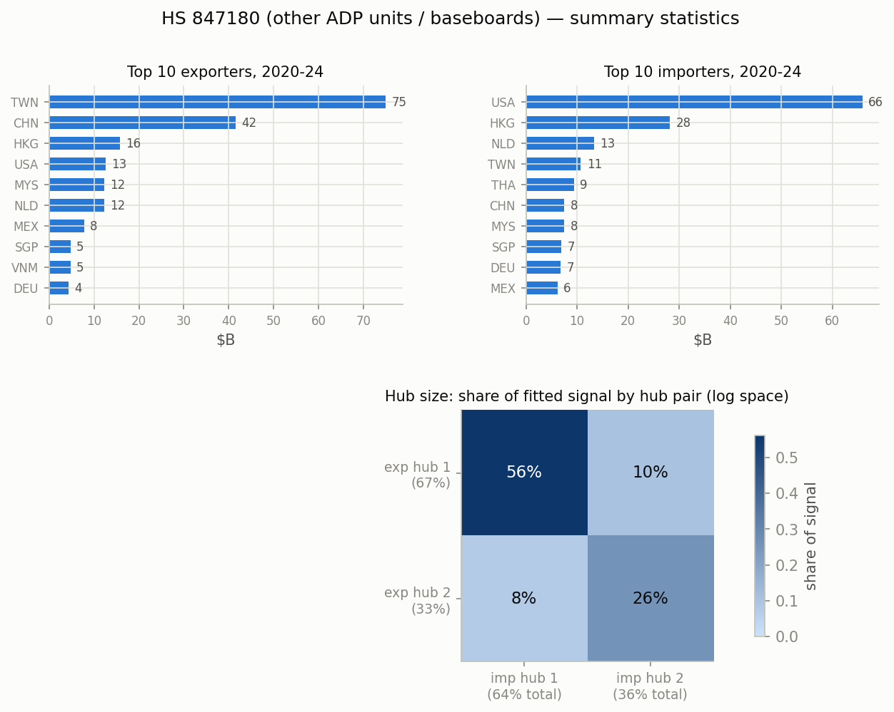
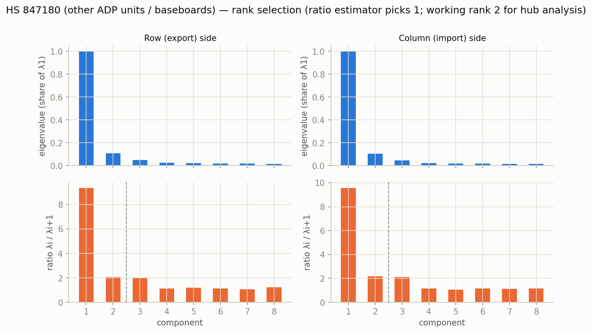
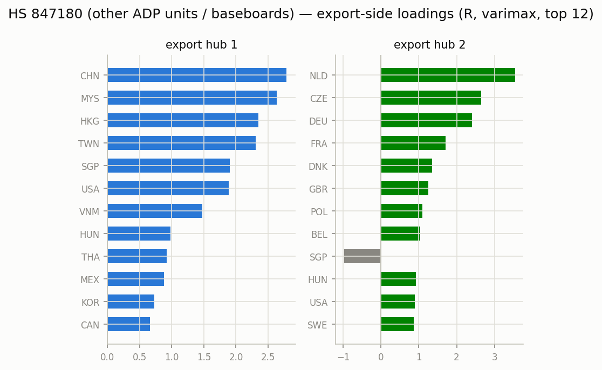
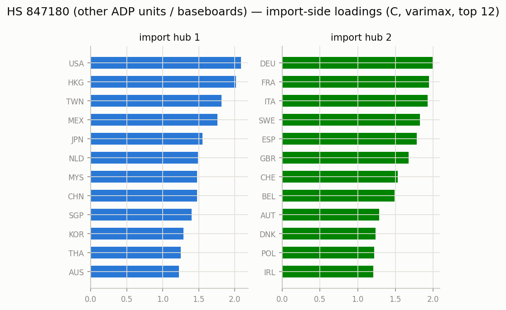
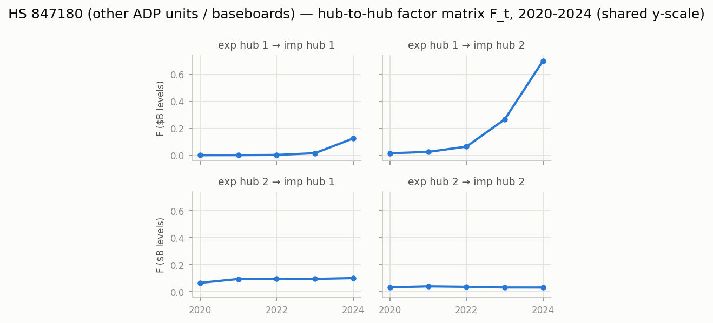

# HS 847180 (other ADP units / baseboards) — matrix factor model, 2020-2024

Constant-loading matrix factor model `Y_t = R F_t C' + E_t` on annual bilateral
log1p export matrices (Atlas HS2012 bilateral data), top 40 countries
covering 97.1% of $210B world trade.
Estimation per Chen, Chen, Bolivar & Chen (2024), `docs/references/`; varimax
rotation on each side; hub size = share of fitted signal (exact under the
orthonormal-loading decomposition, log space — not dollar shares).

- **Rank:** eigenvalue-ratio estimator picks 1 (the dominant
  gravity/size factor); working rank for hub analysis k=2, r=2 (2nd ratio peak).
- **Fit:** uncentered R^2 0.807 (rank-1 baseline 0.731).

## Top traders, 2020-2024 ($B)

| # | exporter | $B | importer | $B |
|---|---|---:|---|---:|
| 1 | TWN | 74.9 | USA | 65.9 |
| 2 | CHN | 41.5 | HKG | 28.2 |
| 3 | HKG | 15.8 | NLD | 13.3 |
| 4 | USA | 12.5 | TWN | 10.7 |
| 5 | MYS | 12.3 | THA | 9.4 |
| 6 | NLD | 12.2 | CHN | 7.5 |
| 7 | MEX | 7.8 | MYS | 7.5 |
| 8 | SGP | 4.7 | SGP | 6.9 |
| 9 | VNM | 4.7 | DEU | 6.8 |
| 10 | DEU | 4.3 | MEX | 6.2 |

## Hub structure

Export-hub sizes: hub 1 67%, hub 2 33%.
Import-hub sizes: hub 1 64%, hub 2 36%.

Share of fitted signal by hub pair (rows = export hub, cols = import hub):

| | imp 1 | imp 2 |
|---|---|---|
| exp 1 | 56% | 10% |
| exp 2 | 8% | 26% |

### Export hubs (varimax loadings, top 8)

- **hub 1** (67%): CHN +2.78, MYS +2.64, HKG +2.35, TWN +2.31, SGP +1.91, USA +1.89, VNM +1.47, HUN +0.98
- **hub 2** (33%): NLD +3.54, CZE +2.65, DEU +2.41, FRA +1.70, DNK +1.36, GBR +1.26, POL +1.10, BEL +1.04

### Import hubs (varimax loadings, top 8)

- **hub 1** (64%): USA +2.09, HKG +2.02, TWN +1.81, MEX +1.76, JPN +1.55, NLD +1.49, MYS +1.48, CHN +1.47
- **hub 2** (36%): DEU +1.99, FRA +1.94, ITA +1.93, SWE +1.83, ESP +1.78, GBR +1.68, CHE +1.53, BEL +1.49

## Figures

_Generated by `scripts/prototype_mfm.py`; full numbers in `stats.json`._