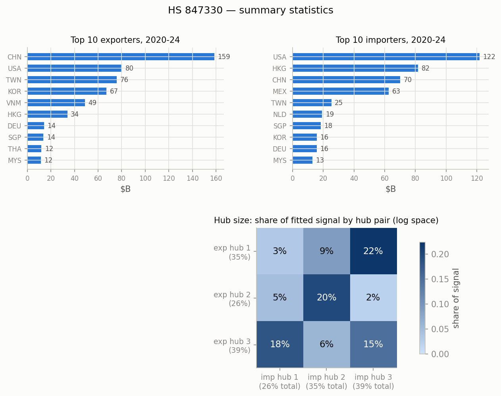
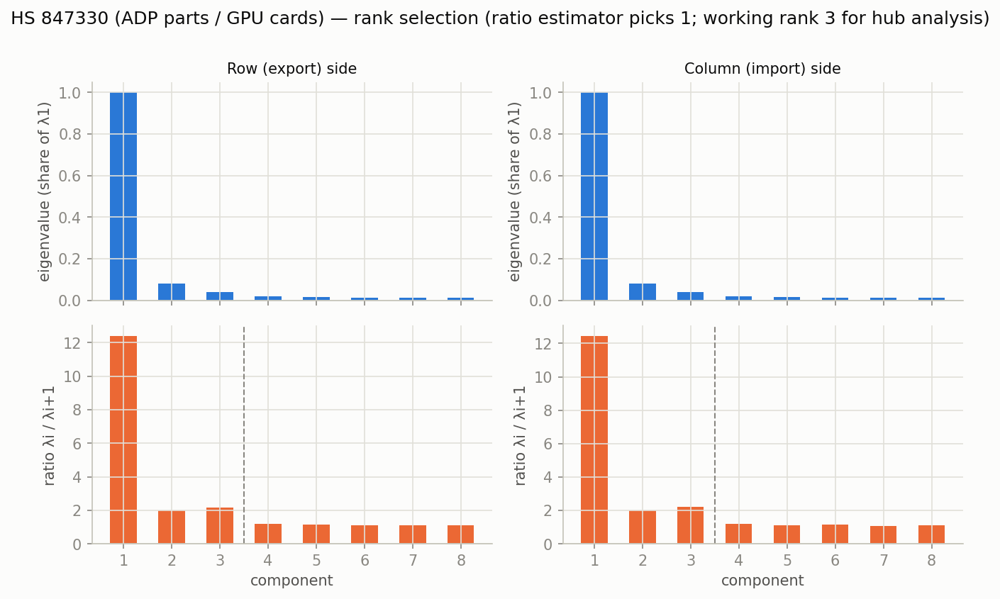
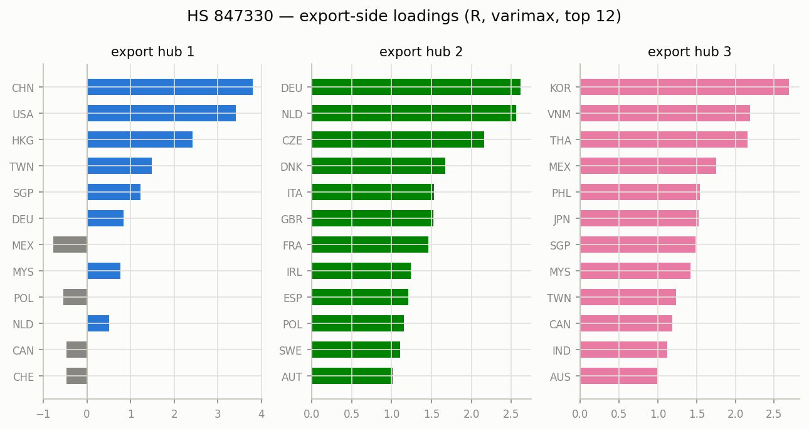
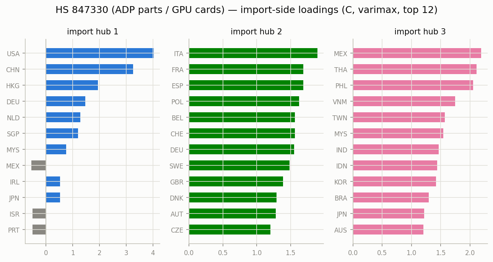

# HS 847330 (ADP parts / GPU cards) — matrix factor model, 2020-2024

Constant-loading matrix factor model `Y_t = R F_t C' + E_t` on annual bilateral
log1p export matrices (Atlas HS2012 bilateral data), top 40 countries
covering 97.4% of $593B world trade.
Estimation per Chen, Chen, Bolivar & Chen (2024), `docs/references/`; varimax
rotation on each side; hub size = share of fitted signal (exact under the
orthonormal-loading decomposition, log space — not dollar shares).

- **Rank:** eigenvalue-ratio estimator picks 1 (the dominant
  gravity/size factor); working rank for hub analysis k=3, r=3 (2nd ratio peak).
- **Fit:** uncentered R^2 0.869 (rank-1 baseline 0.776).

## Top traders, 2020-2024 ($B)

| # | exporter | $B | importer | $B |
|---|---|---:|---|---:|
| 1 | CHN | 158.7 | USA | 121.7 |
| 2 | USA | 80.4 | HKG | 81.8 |
| 3 | TWN | 76.0 | CHN | 70.2 |
| 4 | KOR | 67.2 | MEX | 62.6 |
| 5 | VNM | 48.9 | TWN | 25.3 |
| 6 | HKG | 33.9 | NLD | 19.3 |
| 7 | DEU | 14.1 | SGP | 18.3 |
| 8 | SGP | 13.7 | KOR | 15.9 |
| 9 | THA | 12.0 | DEU | 15.9 |
| 10 | MYS | 11.6 | MYS | 13.0 |

## Hub structure

Export-hub sizes: hub 1 35%, hub 2 26%, hub 3 39%.
Import-hub sizes: hub 1 26%, hub 2 35%, hub 3 39%.

Share of fitted signal by hub pair (rows = export hub, cols = import hub):

| | imp 1 | imp 2 | imp 3 |
|---|---|---|---|
| exp 1 | 3% | 9% | 22% |
| exp 2 | 5% | 20% | 2% |
| exp 3 | 18% | 6% | 15% |

### Export hubs (varimax loadings, top 8)

- **hub 1** (35%): CHN +3.80, USA +3.41, HKG +2.42, TWN +1.48, SGP +1.22, DEU +0.84, MEX -0.77, MYS +0.77
- **hub 2** (26%): DEU +2.62, NLD +2.56, CZE +2.16, DNK +1.67, ITA +1.53, GBR +1.52, FRA +1.46, IRL +1.24
- **hub 3** (39%): KOR +2.69, VNM +2.19, THA +2.15, MEX +1.75, PHL +1.54, JPN +1.53, SGP +1.48, MYS +1.42

### Import hubs (varimax loadings, top 8)

- **hub 1** (26%): USA +4.04, CHN +3.26, HKG +1.94, DEU +1.47, NLD +1.29, SGP +1.19, MYS +0.76, MEX -0.55
- **hub 2** (35%): ITA +1.90, FRA +1.69, ESP +1.69, POL +1.63, BEL +1.57, CHE +1.56, DEU +1.55, SWE +1.49
- **hub 3** (39%): MEX +2.19, THA +2.11, PHL +2.05, VNM +1.75, TWN +1.57, MYS +1.54, IND +1.46, IDN +1.44

## Figures

_Generated by `scripts/prototype_mfm.py`; full numbers in `stats.json`._