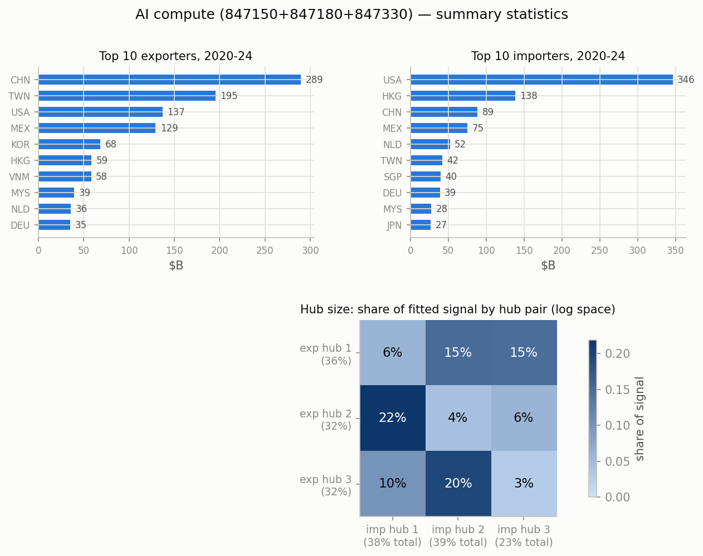
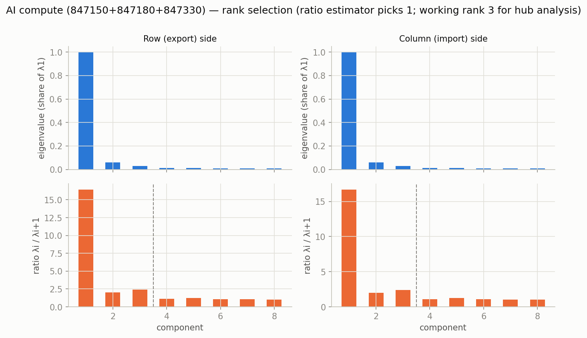
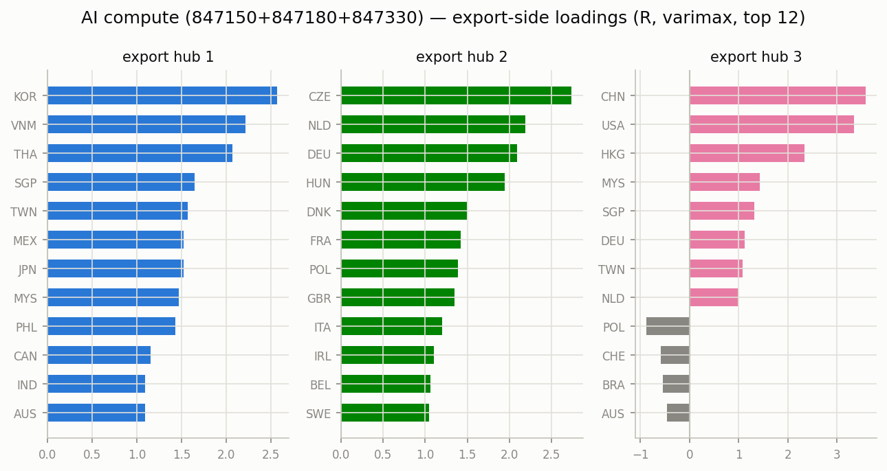
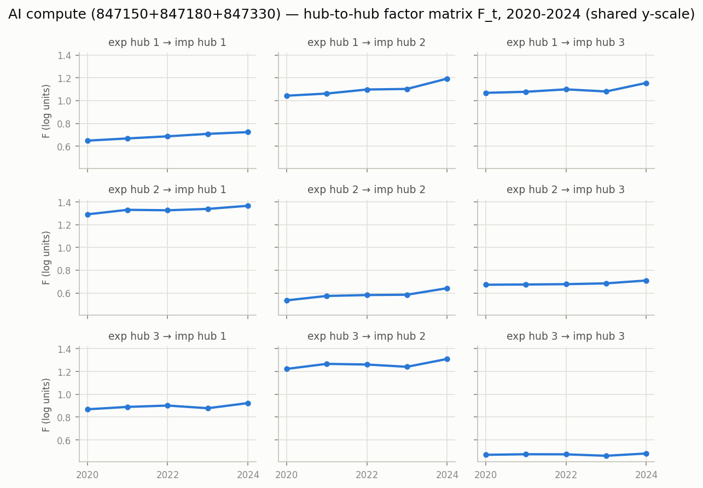

# AI compute (847150+847180+847330) — matrix factor model, 2020-2024

Constant-loading matrix factor model `Y_t = R F_t C' + E_t` on annual bilateral
log1p export matrices (Atlas HS2012 bilateral data), top 40 countries
covering 96.2% of $1233B world trade.
Estimation per Chen, Chen, Bolivar & Chen (2024), `docs/references/`; varimax
rotation on each side; hub size = share of fitted signal (exact under the
orthonormal-loading decomposition, log space — not dollar shares).

- **Rank:** eigenvalue-ratio estimator picks 1 (the dominant
  gravity/size factor); working rank for hub analysis k=3, r=3 (2nd ratio peak).
- **Fit:** uncentered R^2 0.895 (rank-1 baseline 0.822).

## Top traders, 2020-2024 ($B)

| # | exporter | $B | importer | $B |
|---|---|---:|---|---:|
| 1 | CHN | 289.4 | USA | 346.3 |
| 2 | TWN | 195.3 | HKG | 138.4 |
| 3 | USA | 137.2 | CHN | 88.6 |
| 4 | MEX | 129.4 | MEX | 75.3 |
| 5 | KOR | 68.4 | NLD | 52.3 |
| 6 | HKG | 58.8 | TWN | 42.2 |
| 7 | VNM | 58.2 | SGP | 40.2 |
| 8 | MYS | 39.5 | DEU | 39.0 |
| 9 | NLD | 35.8 | MYS | 27.6 |
| 10 | DEU | 35.3 | JPN | 26.8 |

## Hub structure

Export-hub sizes: hub 1 36%, hub 2 32%, hub 3 32%.
Import-hub sizes: hub 1 38%, hub 2 39%, hub 3 23%.

Share of fitted signal by hub pair (rows = export hub, cols = import hub):

| | imp 1 | imp 2 | imp 3 |
|---|---|---|---|
| exp 1 | 6% | 15% | 15% |
| exp 2 | 22% | 4% | 6% |
| exp 3 | 10% | 20% | 3% |

### Export hubs (varimax loadings, top 8)

- **hub 1** (36%): KOR +2.57, VNM +2.22, THA +2.07, SGP +1.64, TWN +1.57, MEX +1.52, JPN +1.52, MYS +1.47
- **hub 2** (32%): CZE +2.74, NLD +2.19, DEU +2.09, HUN +1.94, DNK +1.50, FRA +1.42, POL +1.39, GBR +1.34
- **hub 3** (32%): CHN +3.59, USA +3.36, HKG +2.34, MYS +1.43, SGP +1.32, DEU +1.12, TWN +1.08, NLD +0.99

### Import hubs (varimax loadings, top 8)

- **hub 1** (38%): ITA +1.85, SWE +1.80, ESP +1.76, CHE +1.72, BEL +1.64, DNK +1.55, FRA +1.50, GBR +1.47
- **hub 2** (39%): THA +2.09, MEX +2.04, PHL +1.86, VNM +1.82, TWN +1.61, IDN +1.54, IND +1.48, KOR +1.48
- **hub 3** (23%): USA +4.10, CHN +2.97, HKG +1.81, DEU +1.69, NLD +1.53, SGP +0.99, KAZ -0.79, MYS +0.77

## Figures

_Generated by `scripts/prototype_mfm.py`; full numbers in `stats.json`._