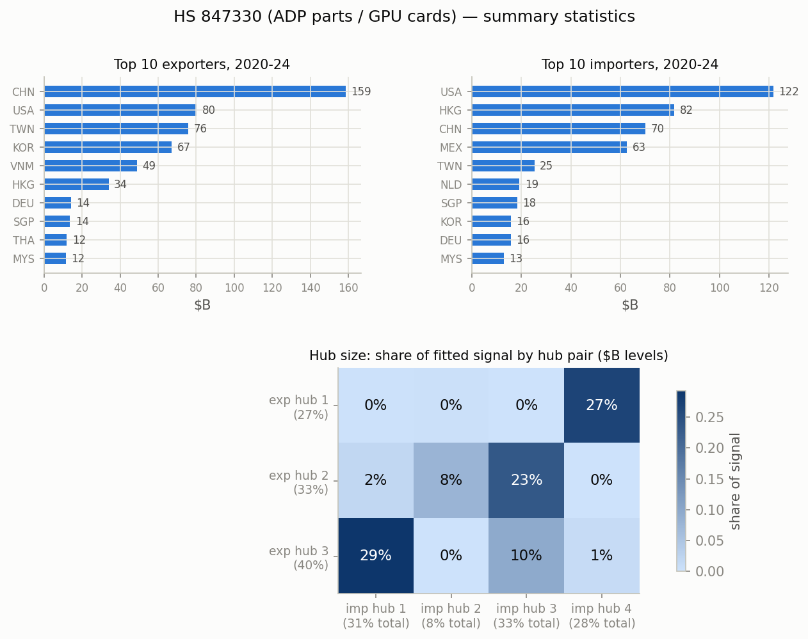
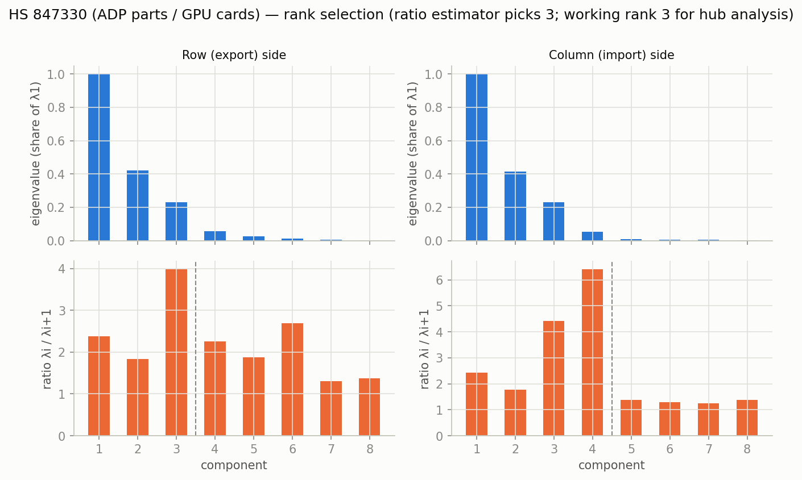
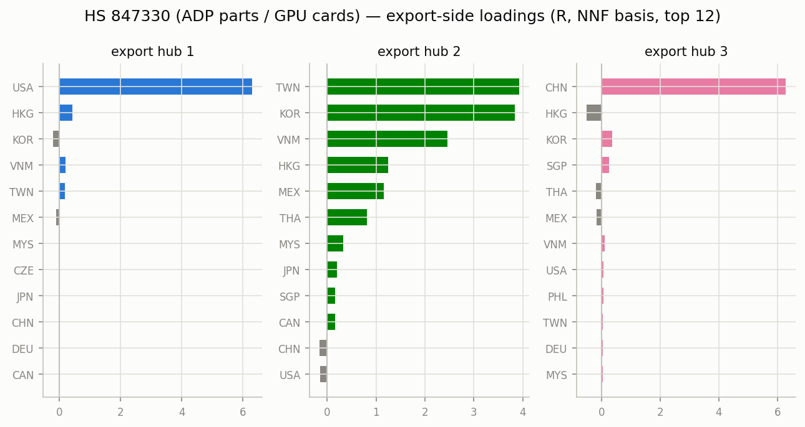
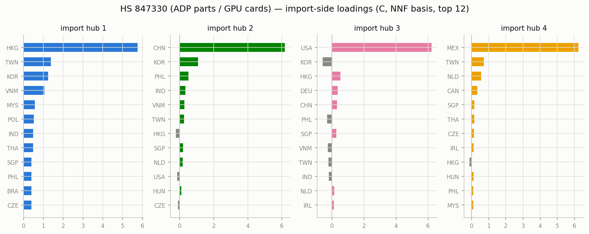
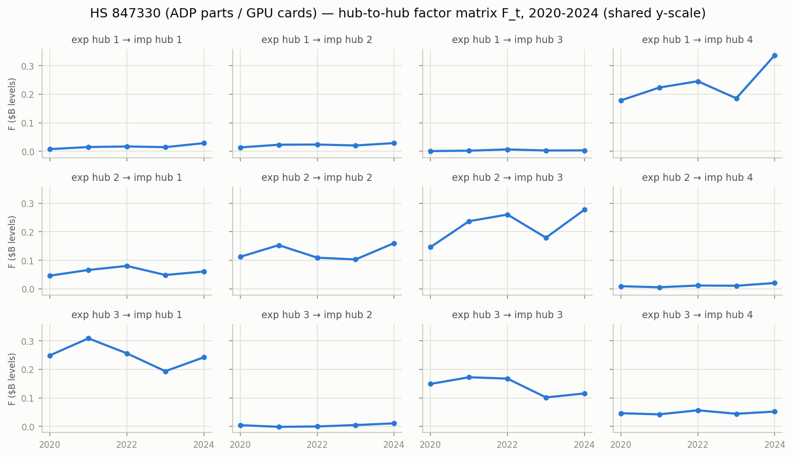

# HS 847330 (ADP parts / GPU cards) — matrix factor model, 2020-2024

Constant-loading matrix factor model `Y_t = R F_t C' + E_t` on annual bilateral
export matrices in $B levels (Atlas HS2012 bilateral data), top 40 countries
covering 97.4% of $593B world trade.
Estimation per Chen, Chen, Bolivar & Chen (2024), `docs/references/`; the
nonnegativity-identified basis on each side; hub size = share of fitted signal (exact under the
orthonormal-loading decomposition, $B levels).

- **Rank:** eigenvalue-ratio estimator picks 3 (the dominant
  gravity/size factor); working rank for hub analysis k=3, r=4 (2nd ratio peak).
- **Fit:** uncentered R^2 0.929 (rank-1 baseline 0.559).

## Top traders, 2020-2024 ($B)

| # | exporter | $B | importer | $B |
|---|---|---:|---|---:|
| 1 | CHN | 158.7 | USA | 121.7 |
| 2 | USA | 80.4 | HKG | 81.8 |
| 3 | TWN | 76.0 | CHN | 70.2 |
| 4 | KOR | 67.2 | MEX | 62.6 |
| 5 | VNM | 48.9 | TWN | 25.3 |
| 6 | HKG | 33.9 | NLD | 19.3 |
| 7 | DEU | 14.1 | SGP | 18.3 |
| 8 | SGP | 13.7 | KOR | 15.9 |
| 9 | THA | 12.0 | DEU | 15.9 |
| 10 | MYS | 11.6 | MYS | 13.0 |

## Hub structure

Export-hub sizes: hub 1 27%, hub 2 33%, hub 3 40%.
Import-hub sizes: hub 1 31%, hub 2 8%, hub 3 33%, hub 4 28%.

Share of fitted signal by hub pair (rows = export hub, cols = import hub):

| | imp 1 | imp 2 | imp 3 | imp 4 |
|---|---|---|---|---|
| exp 1 | 0% | 0% | 0% | 27% |
| exp 2 | 2% | 8% | 23% | 0% |
| exp 3 | 29% | 0% | 10% | 1% |

### Export hubs (NNF-basis loadings, top 8)

- **hub 1** (27%): USA +6.30, HKG +0.43, KOR -0.21, VNM +0.20, TWN +0.19, MEX -0.09, MYS +0.03, CZE +0.02
- **hub 2** (33%): TWN +3.92, KOR +3.84, VNM +2.46, HKG +1.25, MEX +1.16, THA +0.81, MYS +0.33, JPN +0.20
- **hub 3** (40%): CHN +6.28, HKG -0.51, KOR +0.37, SGP +0.25, THA -0.18, MEX -0.16, VNM +0.11, USA +0.06

### Import hubs (NNF-basis loadings, top 8)

- **hub 1** (31%): HKG +5.76, TWN +1.37, KOR +1.24, VNM +1.05, MYS +0.58, POL +0.52, IND +0.49, THA +0.49
- **hub 2** (8%): CHN +6.17, KOR +1.08, PHL +0.51, IND +0.34, VNM +0.27, TWN +0.26, HKG -0.22, SGP +0.20
- **hub 3** (33%): USA +6.22, KOR -0.58, HKG +0.53, DEU +0.36, CHN +0.31, PHL -0.30, SGP +0.28, VNM -0.27
- **hub 4** (28%): MEX +6.24, TWN +0.72, NLD +0.56, CAN +0.35, SGP +0.17, THA +0.16, CZE +0.13, IRL +0.13

## Figures

_Generated by `scripts/prototype_mfm.py`; full numbers in `stats.json`._