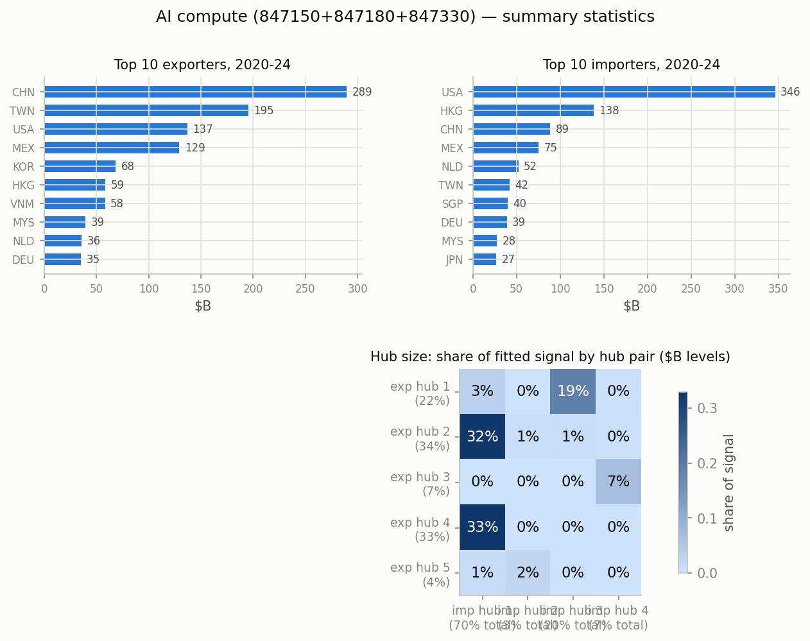
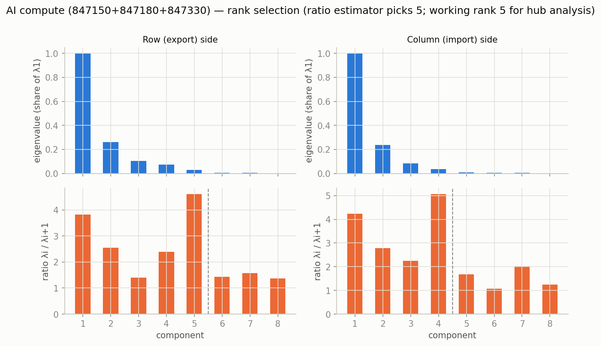
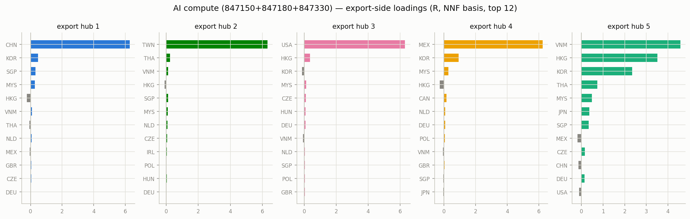
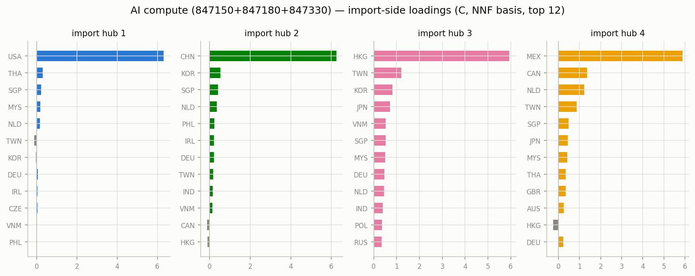
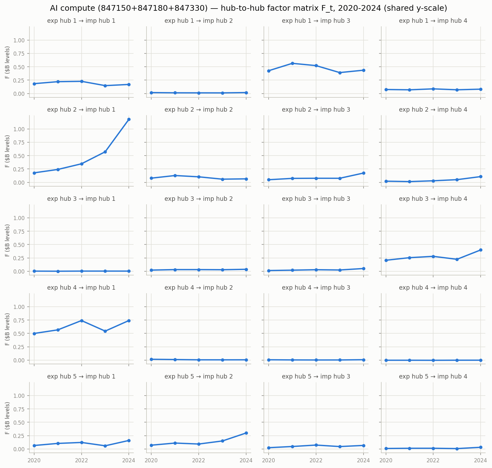

# AI compute (847150+847180+847330) — matrix factor model, 2020-2024

Constant-loading matrix factor model `Y_t = R F_t C' + E_t` on annual bilateral
export matrices in $B levels (Atlas HS2012 bilateral data), top 40 countries
covering 96.2% of $1233B world trade.
Estimation per Chen, Chen, Bolivar & Chen (2024), `docs/references/`; the
nonnegativity-identified basis on each side; hub size = share of fitted signal (exact under the
orthonormal-loading decomposition, $B levels).

- **Rank:** eigenvalue-ratio estimator picks 5 (the dominant
  gravity/size factor); working rank for hub analysis k=5, r=4 (2nd ratio peak).
- **Fit:** uncentered R^2 0.977 (rank-1 baseline 0.666).

## Top traders, 2020-2024 ($B)

| # | exporter | $B | importer | $B |
|---|---|---:|---|---:|
| 1 | CHN | 289.4 | USA | 346.3 |
| 2 | TWN | 195.3 | HKG | 138.4 |
| 3 | USA | 137.2 | CHN | 88.6 |
| 4 | MEX | 129.4 | MEX | 75.3 |
| 5 | KOR | 68.4 | NLD | 52.3 |
| 6 | HKG | 58.8 | TWN | 42.2 |
| 7 | VNM | 58.2 | SGP | 40.2 |
| 8 | MYS | 39.5 | DEU | 39.0 |
| 9 | NLD | 35.8 | MYS | 27.6 |
| 10 | DEU | 35.3 | JPN | 26.8 |

## Hub structure

Export-hub sizes: hub 1 22%, hub 2 34%, hub 3 7%, hub 4 33%, hub 5 4%.
Import-hub sizes: hub 1 70%, hub 2 3%, hub 3 20%, hub 4 7%.

Share of fitted signal by hub pair (rows = export hub, cols = import hub):

| | imp 1 | imp 2 | imp 3 | imp 4 |
|---|---|---|---|---|
| exp 1 | 3% | 0% | 19% | 0% |
| exp 2 | 32% | 1% | 1% | 0% |
| exp 3 | 0% | 0% | 0% | 7% |
| exp 4 | 33% | 0% | 0% | 0% |
| exp 5 | 1% | 2% | 0% | 0% |

### Export hubs (NNF-basis loadings, top 8)

- **hub 1** (22%): CHN +6.29, KOR +0.48, SGP +0.31, MYS +0.28, HKG -0.24, VNM +0.08, THA -0.08, NLD +0.06
- **hub 2** (34%): TWN +6.32, THA +0.24, VNM +0.11, HKG -0.11, SGP +0.11, MYS +0.09, NLD +0.08, CZE +0.06
- **hub 3** (7%): USA +6.31, HKG +0.36, KOR -0.13, MYS +0.12, CZE +0.11, HUN +0.09, DEU +0.08, VNM -0.08
- **hub 4** (33%): MEX +6.24, KOR +0.93, MYS +0.29, HKG -0.26, CAN +0.17, NLD +0.09, DEU +0.09, POL +0.07
- **hub 5** (4%): VNM +4.58, HKG +3.52, KOR +2.35, THA +0.73, MYS +0.49, JPN +0.36, SGP +0.33, MEX -0.19

### Import hubs (NNF-basis loadings, top 8)

- **hub 1** (70%): USA +6.31, THA +0.29, SGP +0.21, MYS +0.17, NLD +0.16, TWN -0.13, KOR -0.05, DEU +0.05
- **hub 2** (3%): CHN +6.26, KOR +0.53, SGP +0.41, NLD +0.36, PHL +0.23, IRL +0.22, DEU +0.21, TWN +0.18
- **hub 3** (20%): HKG +5.94, TWN +1.21, KOR +0.83, JPN +0.72, VNM +0.52, SGP +0.52, MYS +0.51, DEU +0.46
- **hub 4** (7%): MEX +5.89, CAN +1.36, NLD +1.21, TWN +0.86, SGP +0.48, JPN +0.44, MYS +0.42, THA +0.35

## Figures

_Generated by `scripts/prototype_mfm.py`; full numbers in `stats.json`._