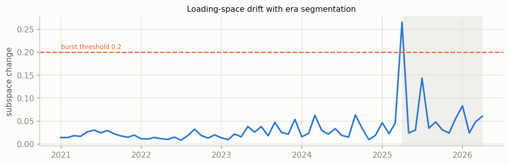
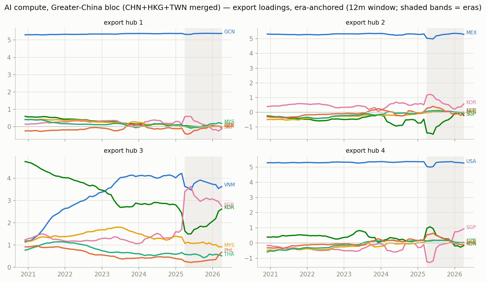
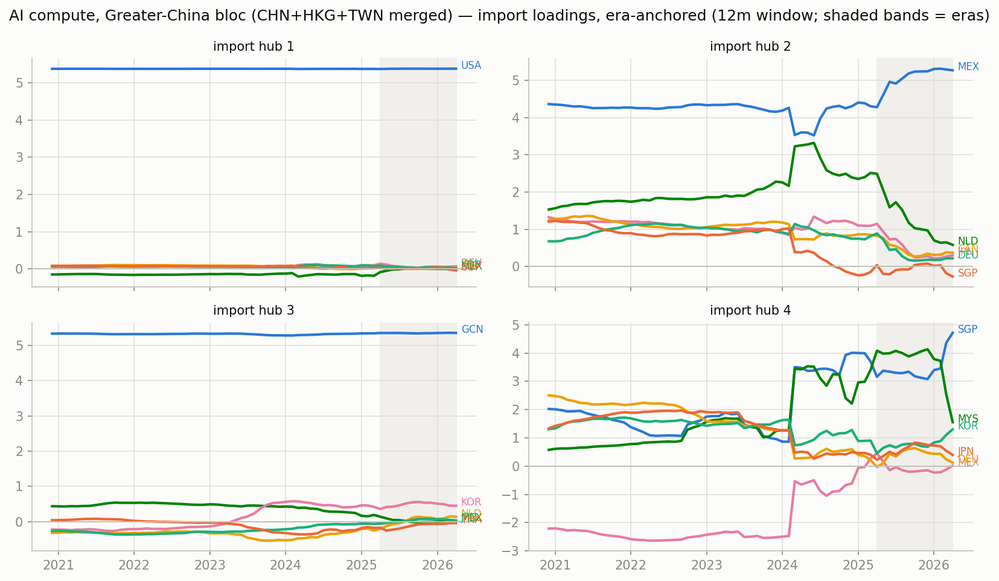
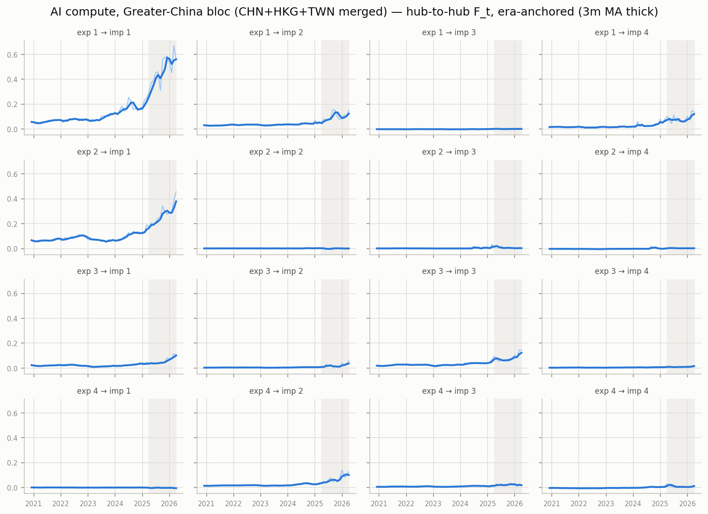

# Era-anchored time-varying MFM — AI compute, Greater-China bloc (CHN+HKG+TWN merged), monthly panel

12m trailing loadings, k=r=4, $B levels; months aligned to per-era constant anchors (Procrustes), no chained matching. In-sample R^2 0.991; mean within-era loading step 0.029 (chained version: see ../tv_ai_compute_monthly_12m).

## Era 0: 2020-12 .. 2025-03

- export hub 1 (GCN-led, serves USA-hub): GCN +5.37, SGP +0.15, NLD +0.14, MYS +0.13, CZE +0.12, KOR -0.11
- export hub 2 (MEX-led, serves USA-hub): MEX +5.34, KOR +0.50, SGP -0.41, VNM -0.21, CZE -0.12, NLD -0.11
- export hub 3 (VNM-led, serves GCN-hub): VNM +3.81, KOR +3.04, MYS +1.47, SGP +1.45, THA +0.75, PHL +0.49
- export hub 4 (USA-led, serves MEX-hub): USA +5.37, KOR +0.28, VNM -0.17, SGP -0.15, CZE +0.12, HUN +0.12

## Era 1: 2025-04 .. 2026-04

- export hub 1 (GCN-led, serves USA-hub): GCN +5.38, MYS +0.19, SGP -0.15, VNM +0.11, THA -0.06, KOR -0.05
- export hub 2 (MEX-led, serves USA-hub): MEX +5.31, THA +0.65, KOR +0.55, VNM -0.24, SGP -0.19, HUN +0.14
- export hub 3 (VNM-led, serves GCN-hub): VNM +3.60, SGP +2.85, KOR +2.52, MYS +0.91, PHL +0.64, THA +0.51
- export hub 4 (USA-led, serves MEX-hub): USA +5.27, SGP +0.94, VNM -0.51, KOR -0.18, MYS -0.10, IRL +0.09

## Cross-era hub crosswalk (|cosine| between anchor loadings, rows = earlier era hub, cols = later era hub)

### era 0 -> era 1

| | hub 1' | hub 2' | hub 3' | hub 4' |
|---|---|---|---|---|
| hub 1 | 1.00 | 0.00 | 0.01 | 0.01 |
| hub 2 | 0.00 | 0.99 | 0.03 | 0.01 |
| hub 3 | 0.01 | 0.03 | 0.95 | 0.05 |
| hub 4 | 0.00 | 0.01 | 0.02 | 0.97 |

## Figures

_Generated by `scripts/tvmfm_monthly_anchored.py`._