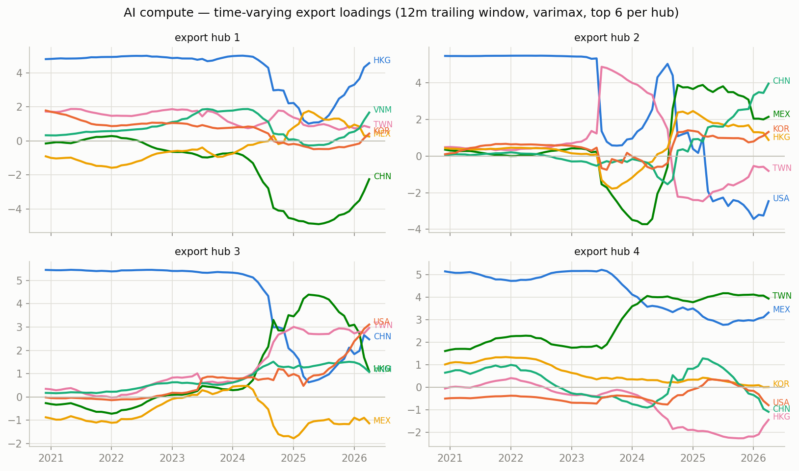
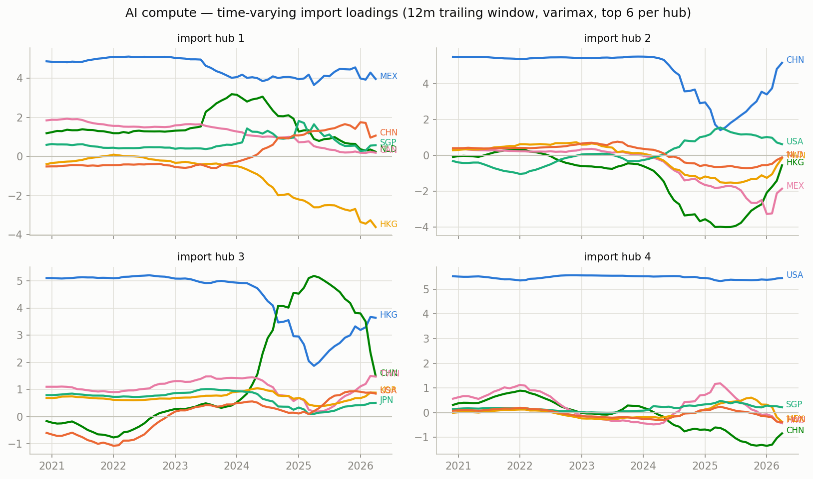
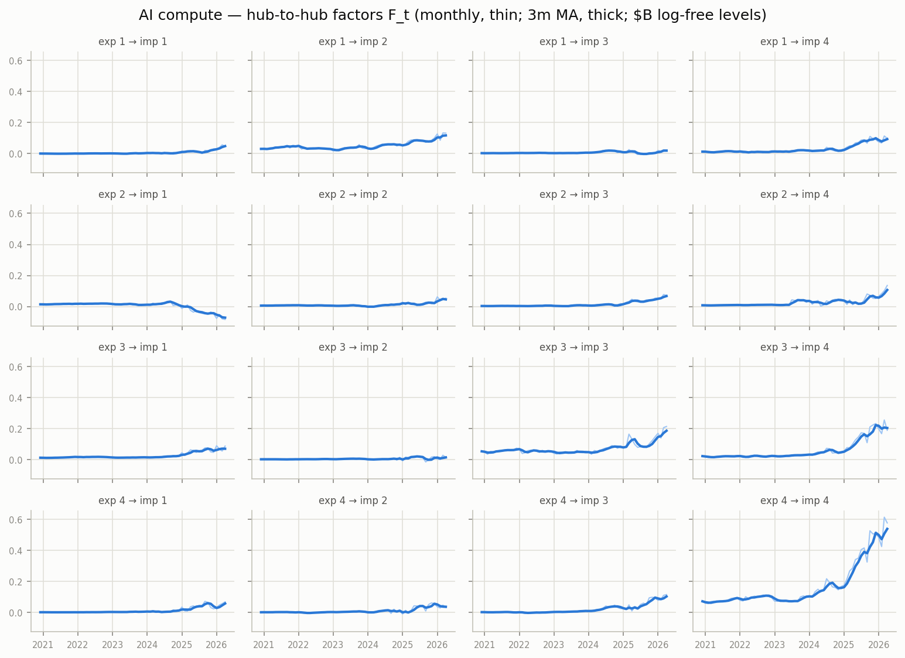
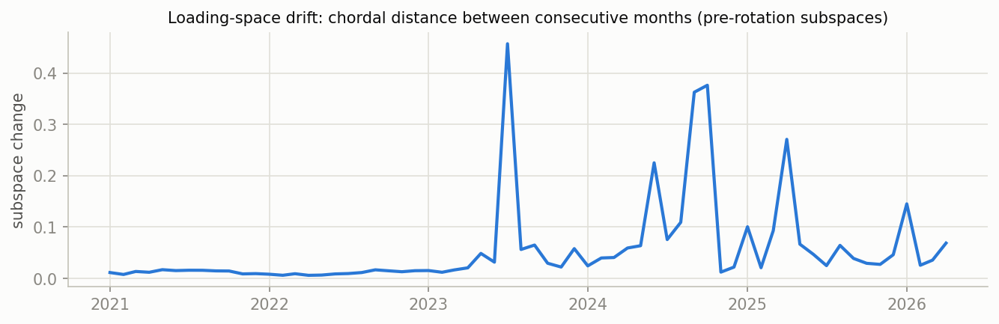

# Time-varying MFM — AI compute, monthly panel, 12m trailing window

k=r=4, $B levels, one global varimax; in-sample R^2 0.976; mean monthly subspace drift 0.057.

## Export hubs at 2020-12

- hub 1: HKG +4.81, KOR +1.78, TWN +1.72, MEX -0.91, USA -0.50, THA +0.37
- hub 2: USA +5.47, CZE +0.49, TWN +0.49, HKG +0.43, MEX +0.35, NLD +0.32
- hub 3: CHN +5.46, MEX -0.88, TWN +0.35, SGP +0.33, HKG -0.27, KOR +0.26
- hub 4: MEX +5.15, TWN +1.61, KOR +1.01, CHN +0.65, USA -0.50, VNM +0.27

## Export hubs at 2023-08

- hub 1: HKG +4.69, VNM +1.87, TWN +1.76, CHN -0.98, KOR +0.85, MEX -0.63
- hub 2: TWN +4.81, MEX -1.71, HKG -1.58, VNM -1.04, USA +0.78, KOR -0.75
- hub 3: CHN +5.33, USA +0.87, KOR +0.65, TWN +0.64, VNM +0.58, MYS +0.47
- hub 4: MEX +5.16, TWN +1.90, CHN -0.44, USA -0.43, KOR +0.42, HKG -0.24

## Export hubs at 2026-04

- hub 1: HKG +4.57, CHN -2.26, VNM +1.66, USA -0.95, TWN +0.80, SGP -0.49
- hub 2: CHN +3.96, USA -2.46, MEX +2.15, KOR +1.32, VNM +1.03, HKG +0.88
- hub 3: USA +3.11, TWN +2.97, CHN +2.47, SGP +1.45, MEX -1.13, HKG +1.10
- hub 4: TWN +3.94, MEX +3.32, HKG -1.45, CHN -1.09, USA -0.80, VNM -0.52

## Figures

_Generated by `scripts/tvmfm_monthly.py`; full paths in `stats.json`._