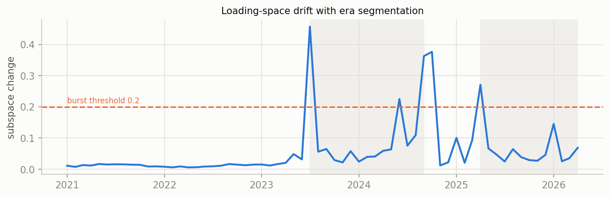
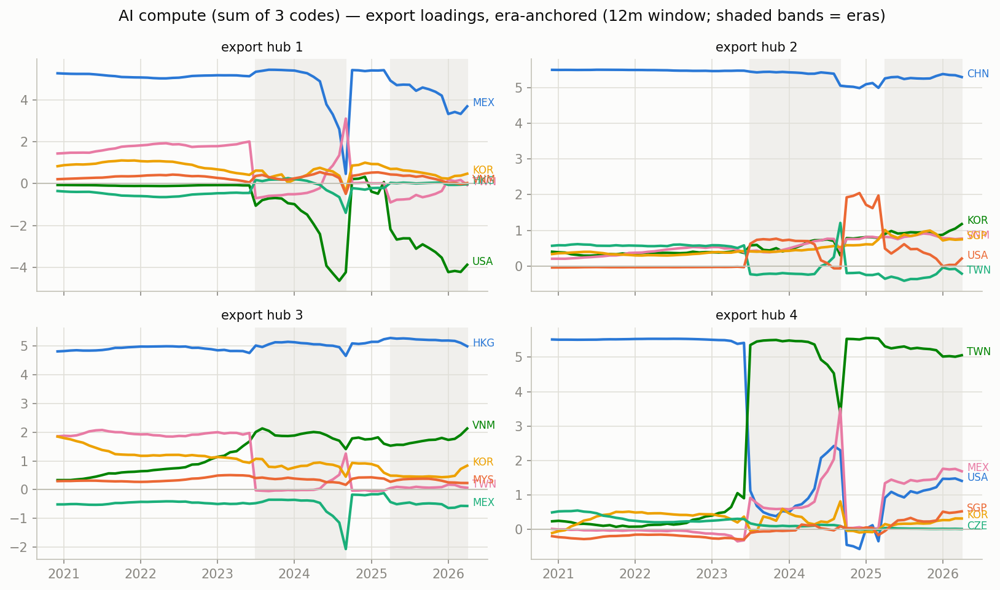
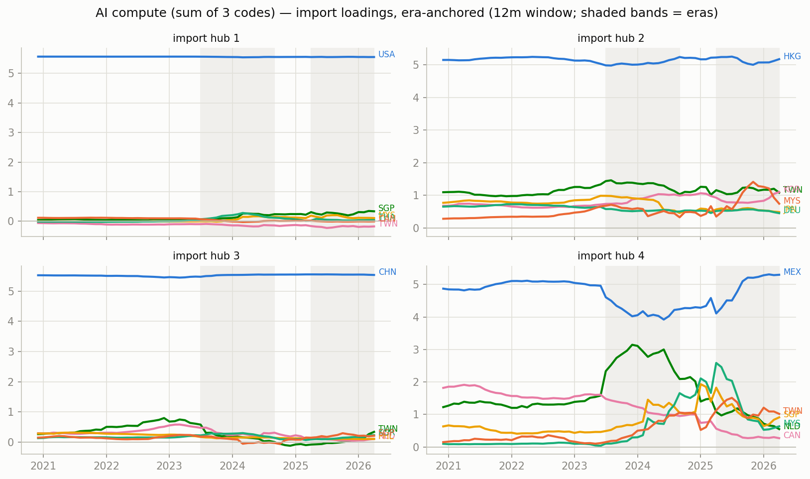
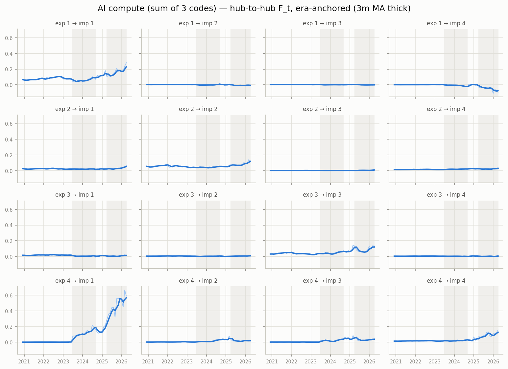

# Era-anchored time-varying MFM — AI compute (sum of 3 codes), monthly panel

12m trailing loadings, k=r=4, $B levels; months aligned to per-era constant anchors (Procrustes), no chained matching. In-sample R^2 0.976; mean within-era loading step 0.042 (chained version: see ../tv_ai_compute_monthly_12m).

## Era 0: 2020-12 .. 2023-06

- export hub 1 (MEX-led, serves USA-hub): MEX +5.13, TWN +1.91, KOR +0.75, HKG -0.53, VNM +0.28, MYS +0.22
- export hub 2 (CHN-led, serves HKG-hub): CHN +5.48, TWN +0.56, VNM +0.42, KOR +0.39, SGP +0.35, MYS +0.30
- export hub 3 (HKG-led, serves CHN-hub): HKG +4.93, TWN +1.93, KOR +1.17, VNM +0.94, MEX -0.46, THA +0.45
- export hub 4 (USA-led, serves MEX-hub): USA +5.51, TWN +0.41, KOR +0.38, CZE +0.28, VNM -0.22, SGP -0.21

## Era 1: 2023-07 .. 2024-09

- export hub 1 (MEX-led, serves USA-hub): MEX +4.24, USA -3.46, KOR +0.78, VNM +0.50, TWN +0.23, HKG -0.21
- export hub 2 (CHN-led, serves HKG-hub): CHN +5.40, KOR +0.78, VNM +0.77, SGP +0.55, MYS +0.45, USA +0.28
- export hub 3 (HKG-led, serves CHN-hub): HKG +5.07, VNM +1.83, KOR +0.86, MEX -0.72, USA -0.71, MYS +0.27
- export hub 4 (TWN-led, serves USA-hub): TWN +5.10, USA +1.82, MEX +1.22, THA +0.22, HKG +0.19, MYS +0.14

## Era 2: 2024-10 .. 2025-03

- export hub 1 (MEX-led, serves USA-hub): MEX +5.23, USA -1.67, KOR +0.68, VNM +0.50, MYS +0.20, HKG -0.19
- export hub 2 (CHN-led, serves HKG-hub): CHN +5.41, VNM +0.76, KOR +0.70, SGP +0.69, USA +0.30, MYS +0.23
- export hub 3 (HKG-led, serves CHN-hub): HKG +5.30, VNM +1.49, USA -0.60, KOR +0.37, THA +0.27, MYS +0.27
- export hub 4 (TWN-led, serves USA-hub): TWN +5.38, USA +1.37, MYS +0.31, MEX +0.21, KOR +0.14, HKG +0.06

## Era 3: 2025-04 .. 2026-04

- export hub 1 (USA-led, serves USA-hub): USA -3.89, MEX +3.68, SGP -1.38, KOR +0.47, THA +0.44, HUN +0.07
- export hub 2 (CHN-led, serves HKG-hub): CHN +5.29, KOR +1.16, SGP +0.82, VNM +0.77, MYS +0.35, MEX +0.30
- export hub 3 (HKG-led, serves CHN-hub): HKG +5.06, VNM +2.02, KOR +0.74, MEX -0.55, USA -0.40, PHL +0.34
- export hub 4 (TWN-led, serves USA-hub): TWN +5.05, MEX +1.70, USA +1.41, SGP +0.54, VNM +0.33, KOR +0.31

## Cross-era hub crosswalk (|cosine| between anchor loadings, rows = earlier era hub, cols = later era hub)

### era 0 -> era 1

| | hub 1' | hub 2' | hub 3' | hub 4' |
|---|---|---|---|---|
| hub 1 | 0.75 | 0.01 | 0.15 | 0.51 |
| hub 2 | 0.01 | 0.99 | 0.02 | 0.08 |
| hub 3 | 0.03 | 0.01 | 0.93 | 0.33 |
| hub 4 | 0.63 | 0.05 | 0.15 | 0.39 |

### era 1 -> era 2

| | hub 1' | hub 2' | hub 3' | hub 4' |
|---|---|---|---|---|
| hub 1 | 0.93 | 0.02 | 0.04 | 0.08 |
| hub 2 | 0.02 | 1.00 | 0.01 | 0.00 |
| hub 3 | 0.06 | 0.01 | 0.99 | 0.02 |
| hub 4 | 0.14 | 0.00 | 0.00 | 0.98 |

### era 2 -> era 3

| | hub 1' | hub 2' | hub 3' | hub 4' |
|---|---|---|---|---|
| hub 1 | 0.84 | 0.08 | 0.05 | 0.26 |
| hub 2 | 0.06 | 0.99 | 0.01 | 0.00 |
| hub 3 | 0.05 | 0.01 | 0.99 | 0.00 |
| hub 4 | 0.15 | 0.02 | 0.01 | 0.95 |

## Figures

_Generated by `scripts/tvmfm_monthly_anchored.py`._