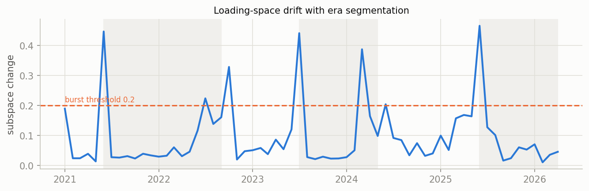
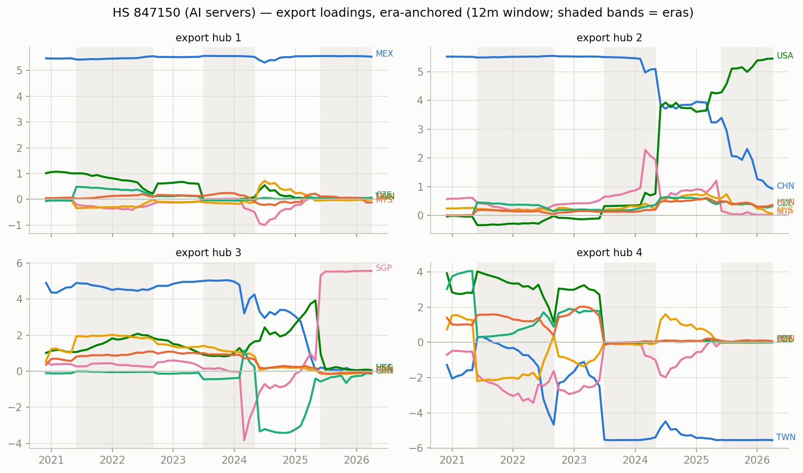
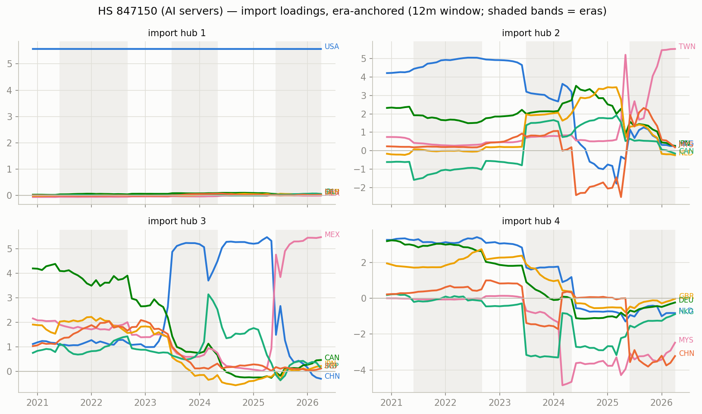
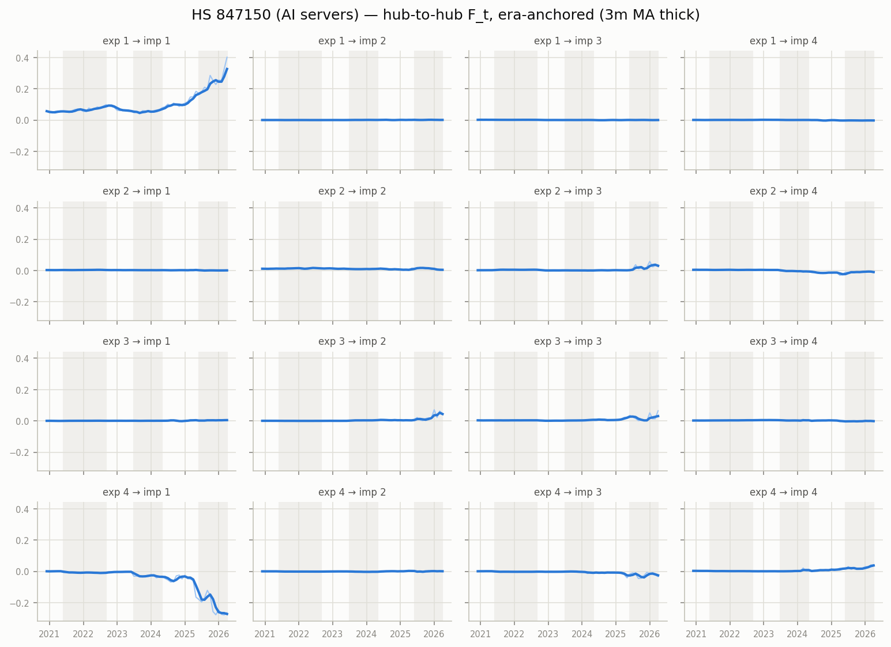

# Era-anchored time-varying MFM — HS 847150 (AI servers), monthly panel

12m trailing loadings, k=r=4, $B levels; months aligned to per-era constant anchors (Procrustes), no chained matching. In-sample R^2 0.986; mean within-era loading step 0.074 (superseded chained version: ../../archive/ai_compute_chained).

## Era 0: 2020-12 .. 2021-05

- export hub 1 (MEX-led, serves USA-hub): MEX +5.50, TWN +0.87, MYS +0.09, DEU +0.08, GBR +0.07, CAN +0.06
- export hub 2 (CHN-led, serves HKG-hub): CHN +5.52, SGP +0.56, TWN +0.34, MYS +0.24, HKG +0.13, NLD +0.12
- export hub 3 (USA-led, serves CAN-hub): USA +5.42, HKG +0.96, SGP +0.72, THA +0.19, MYS +0.19, POL +0.12
- export hub 4 (CZE-led, serves NLD-hub): CZE +4.50, HUN +2.00, NLD +1.40, DEU +1.14, GBR +1.12, SGP -1.04

## Era 1: 2021-06 .. 2022-09

- export hub 1 (MEX-led, serves USA-hub): MEX +5.54, TWN +0.32, SGP -0.31, CZE +0.21, POL +0.14, DEU +0.14
- export hub 2 (CHN-led, serves HKG-hub): CHN +5.55, SGP +0.22, CZE +0.21, MYS +0.16, IRL +0.10, NLD +0.10
- export hub 3 (USA-led, serves NLD-hub): USA +4.56, HKG +1.84, CZE +1.84, HUN +1.09, NLD +0.77, DEU +0.73
- export hub 4 (TWN-led, serves USA-hub): TWN -3.89, SGP -2.79, CZE +1.87, MYS -1.05, POL +0.99, HKG -0.88

## Era 2: 2022-10 .. 2023-06

- export hub 1 (MEX-led, serves USA-hub): MEX +5.52, TWN +0.65, VNM -0.17, MYS +0.13, CZE +0.10, HUN +0.09
- export hub 2 (CHN-led, serves HKG-hub): CHN +5.51, SGP +0.57, TWN +0.35, VNM -0.24, CZE +0.18, HUN +0.12
- export hub 3 (USA-led, serves CAN-hub): USA +5.04, CZE +1.30, HUN +0.94, HKG +0.88, DEU +0.71, VNM +0.61
- export hub 4 (VNM-led, serves USA-hub): VNM -3.46, CZE +2.20, SGP -1.85, TWN -1.76, MYS -1.58, POL +1.44

## Era 3: 2023-07 .. 2024-05

- export hub 1 (MEX-led, serves USA-hub): MEX +5.48, SGP -0.70, HKG -0.44, VNM -0.34, NLD +0.25, MYS -0.23
- export hub 2 (CHN-led, serves HKG-hub): CHN +5.06, SGP +1.96, USA +0.86, VNM -0.57, HKG -0.48, CZE +0.40
- export hub 3 (USA-led, serves CHN-hub): USA +4.14, SGP -2.31, HKG +1.62, VNM +1.30, THA +1.26, MYS +0.97
- export hub 4 (TWN-led, serves USA-hub): TWN -5.23, SGP -1.35, HKG -0.84, VNM -0.70, MYS -0.63, THA -0.40

## Era 4: 2024-06 .. 2025-05

- export hub 1 (MEX-led, serves USA-hub): MEX +5.56, MYS +0.22, HUN +0.15, HKG -0.10, DEU +0.07, NLD +0.07
- export hub 2 (USA-led, serves MYS-hub): USA +4.25, CHN +3.24, SGP +1.20, MYS +0.60, HUN +0.46, CZE +0.39
- export hub 3 (HKG-led, serves CHN-hub): HKG +3.92, MYS +2.70, VNM +2.68, THA +0.73, SGP +0.61, CHN -0.41
- export hub 4 (TWN-led, serves USA-hub): TWN -5.55, MYS +0.23, SGP -0.23, HUN +0.16, VNM -0.11, CHN -0.10

## Era 5: 2025-06 .. 2026-04

- export hub 1 (MEX-led, serves USA-hub): MEX +5.54, THA +0.52, HUN +0.21, HKG -0.13, IRL +0.10, MYS -0.09
- export hub 2 (USA-led, serves MEX-hub): USA +5.49, CHN +0.70, HUN +0.35, CZE +0.32, IRL +0.29, NLD +0.12
- export hub 3 (SGP-led, serves TWN-hub): SGP +5.56, MYS +0.11, CZE -0.10, IRL -0.10, HUN -0.08, HKG +0.06
- export hub 4 (TWN-led, serves USA-hub): TWN -5.56, MYS -0.16, HKG -0.16, VNM -0.14, CHN -0.13, HUN +0.07

## Cross-era hub crosswalk (|cosine| between anchor loadings, rows = earlier era hub, cols = later era hub)

### era 0 -> era 1

| | hub 1' | hub 2' | hub 3' | hub 4' |
|---|---|---|---|---|
| hub 1 | 0.99 | 0.01 | 0.00 | 0.13 |
| hub 2 | 0.01 | 0.99 | 0.01 | 0.10 |
| hub 3 | 0.03 | 0.02 | 0.87 | 0.16 |
| hub 4 | 0.06 | 0.04 | 0.47 | 0.43 |

### era 1 -> era 2

| | hub 1' | hub 2' | hub 3' | hub 4' |
|---|---|---|---|---|
| hub 1 | 1.00 | 0.00 | 0.00 | 0.04 |
| hub 2 | 0.00 | 0.99 | 0.01 | 0.02 |
| hub 3 | 0.00 | 0.02 | 0.97 | 0.10 |
| hub 4 | 0.08 | 0.08 | 0.04 | 0.74 |

### era 2 -> era 3

| | hub 1' | hub 2' | hub 3' | hub 4' |
|---|---|---|---|---|
| hub 1 | 0.98 | 0.00 | 0.00 | 0.13 |
| hub 2 | 0.01 | 0.94 | 0.02 | 0.04 |
| hub 3 | 0.04 | 0.15 | 0.82 | 0.15 |
| hub 4 | 0.11 | 0.01 | 0.02 | 0.52 |

### era 3 -> era 4

| | hub 1' | hub 2' | hub 3' | hub 4' |
|---|---|---|---|---|
| hub 1 | 0.98 | 0.03 | 0.12 | 0.03 |
| hub 2 | 0.02 | 0.74 | 0.13 | 0.00 |
| hub 3 | 0.00 | 0.55 | 0.40 | 0.03 |
| hub 4 | 0.03 | 0.03 | 0.26 | 0.95 |

### era 4 -> era 5

| | hub 1' | hub 2' | hub 3' | hub 4' |
|---|---|---|---|---|
| hub 1 | 0.99 | 0.01 | 0.01 | 0.00 |
| hub 2 | 0.00 | 0.84 | 0.21 | 0.01 |
| hub 3 | 0.02 | 0.01 | 0.12 | 0.05 |
| hub 4 | 0.00 | 0.01 | 0.04 | 1.00 |

## Figures

_Generated by `scripts/tvmfm_monthly_anchored.py`._