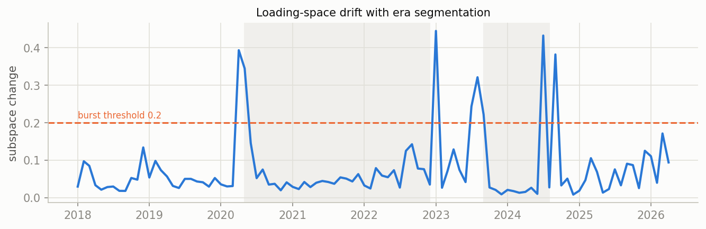
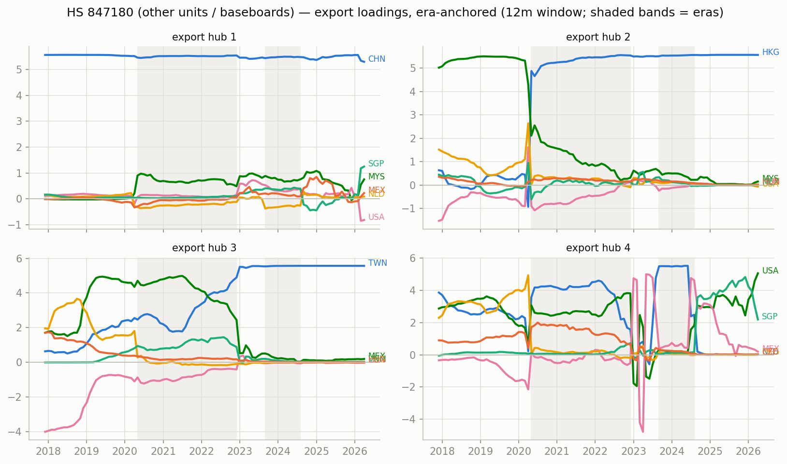
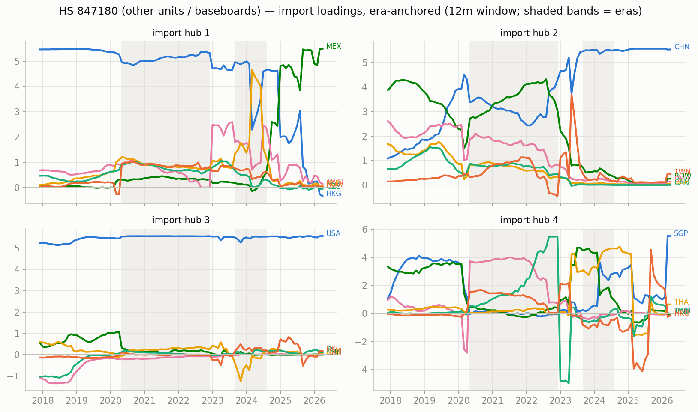
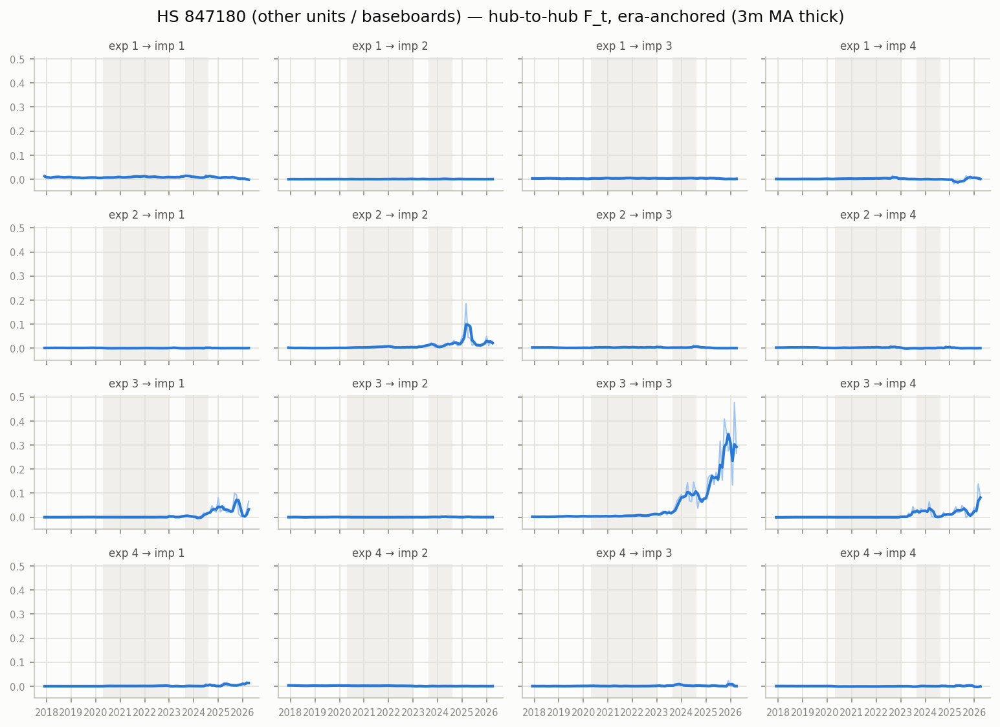

# Era-anchored time-varying MFM — HS 847180 (other units / baseboards), monthly panel

12m trailing loadings, k=r=4, $B levels; months aligned to per-era constant anchors (Procrustes), no chained matching. In-sample R^2 0.984; mean within-era loading step 0.086 (superseded chained version: ../archive/ai_compute_chained).

## Era 0: 2017-12 .. 2020-04

- export hub 1 (CHN-led, serves HKG-hub): CHN +5.56, TWN +0.23, USA +0.16, HKG -0.14, NLD +0.13, CZE +0.05
- export hub 2 (MYS-led, serves SGP-hub): MYS +5.48, USA +0.68, NLD -0.54, HKG +0.27, CZE -0.18, HUN +0.17
- export hub 3 (MEX-led, serves USA-hub): MEX +4.34, TWN +2.35, HKG +1.97, USA -1.39, VNM +0.52, HUN +0.49
- export hub 4 (HKG-led, serves ROW-hub): HKG +3.63, USA +2.81, NLD +2.53, CZE +1.03, MEX -0.95, DEU +0.75

## Era 1: 2020-05 .. 2022-12

- export hub 1 (CHN-led, serves HKG-hub): CHN +5.52, MYS +0.64, NLD -0.18, USA +0.11, SGP +0.09, MEX +0.08
- export hub 2 (HKG-led, serves CHN-hub): HKG +5.51, MYS +0.58, MEX +0.38, HUN +0.20, VNM +0.19, TWN -0.16
- export hub 3 (TWN-led, serves USA-hub): TWN +4.62, MEX +2.88, VNM +0.99, USA -0.43, CAN +0.22, HUN +0.19
- export hub 4 (USA-led, serves CHN-hub): USA +3.44, NLD +3.34, MYS +1.89, CZE +1.32, DEU +1.09, FRA +0.53

## Era 2: 2023-01 .. 2023-08

- export hub 1 (CHN-led, serves HKG-hub): CHN +5.44, MYS +0.93, SGP +0.46, USA +0.41, MEX +0.29, VNM +0.15
- export hub 2 (HKG-led, serves CHN-hub): HKG +5.50, MYS +0.69, MEX +0.35, HUN +0.21, VNM +0.14, SGP +0.11
- export hub 3 (TWN-led, serves USA-hub): TWN +5.55, MEX +0.42, VNM +0.18, MYS +0.07, NLD -0.04, CAN +0.04
- export hub 4 (NLD-led, serves USA-hub): NLD +5.47, MEX +0.77, CZE +0.37, VNM +0.30, DEU +0.27, USA +0.26

## Era 3: 2023-09 .. 2024-08

- export hub 1 (CHN-led, serves HKG-hub): CHN +5.48, MYS +0.76, SGP +0.40, USA +0.39, NLD -0.26, VNM +0.18
- export hub 2 (HKG-led, serves CHN-hub): HKG +5.56, MYS +0.23, HUN +0.09, USA +0.08, CZE +0.04, SGP +0.03
- export hub 3 (TWN-led, serves USA-hub): TWN +5.57, USA -0.06, VNM +0.04, MYS +0.03, MEX +0.03, NLD +0.03
- export hub 4 (MEX-led, serves USA-hub): MEX +4.63, NLD +2.49, USA +1.81, SGP +0.16, CHN -0.12, VNM +0.10

## Era 4: 2024-09 .. 2026-04

- export hub 1 (CHN-led, serves MEX-hub): CHN +5.53, MYS +0.44, SGP +0.36, USA -0.19, VNM +0.14, ROW +0.11
- export hub 2 (HKG-led, serves CHN-hub): HKG +5.57, MYS +0.06, HUN +0.01, DEU +0.01, USA -0.01, THA +0.00
- export hub 3 (TWN-led, serves USA-hub): TWN +5.56, MEX +0.18, MYS +0.07, VNM +0.02, USA -0.02, SGP +0.01
- export hub 4 (USA-led, serves MEX-hub): USA +4.15, SGP +3.63, MEX +0.57, MYS +0.56, CHN -0.14, VNM +0.06

## Cross-era hub crosswalk (|cosine| between anchor loadings, rows = earlier era hub, cols = later era hub)

### era 0 -> era 1

| | hub 1' | hub 2' | hub 3' | hub 4' |
|---|---|---|---|---|
| hub 1 | 0.99 | 0.03 | 0.03 | 0.02 |
| hub 2 | 0.12 | 0.15 | 0.02 | 0.35 |
| hub 3 | 0.01 | 0.41 | 0.79 | 0.18 |
| hub 4 | 0.04 | 0.62 | 0.08 | 0.67 |

### era 1 -> era 2

| | hub 1' | hub 2' | hub 3' | hub 4' |
|---|---|---|---|---|
| hub 1 | 0.99 | 0.01 | 0.01 | 0.04 |
| hub 2 | 0.00 | 1.00 | 0.02 | 0.01 |
| hub 3 | 0.03 | 0.01 | 0.87 | 0.09 |
| hub 4 | 0.08 | 0.04 | 0.09 | 0.64 |

### era 2 -> era 3

| | hub 1' | hub 2' | hub 3' | hub 4' |
|---|---|---|---|---|
| hub 1 | 1.00 | 0.01 | 0.00 | 0.05 |
| hub 2 | 0.00 | 0.99 | 0.00 | 0.06 |
| hub 3 | 0.00 | 0.00 | 1.00 | 0.06 |
| hub 4 | 0.04 | 0.00 | 0.00 | 0.57 |

### era 3 -> era 4

| | hub 1' | hub 2' | hub 3' | hub 4' |
|---|---|---|---|---|
| hub 1 | 0.99 | 0.00 | 0.00 | 0.09 |
| hub 2 | 0.00 | 1.00 | 0.00 | 0.02 |
| hub 3 | 0.00 | 0.00 | 1.00 | 0.01 |
| hub 4 | 0.01 | 0.00 | 0.02 | 0.35 |

## Figures

_Generated by `scripts/tvmfm_monthly_anchored.py`._