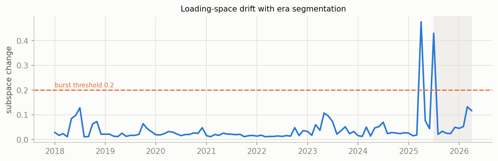
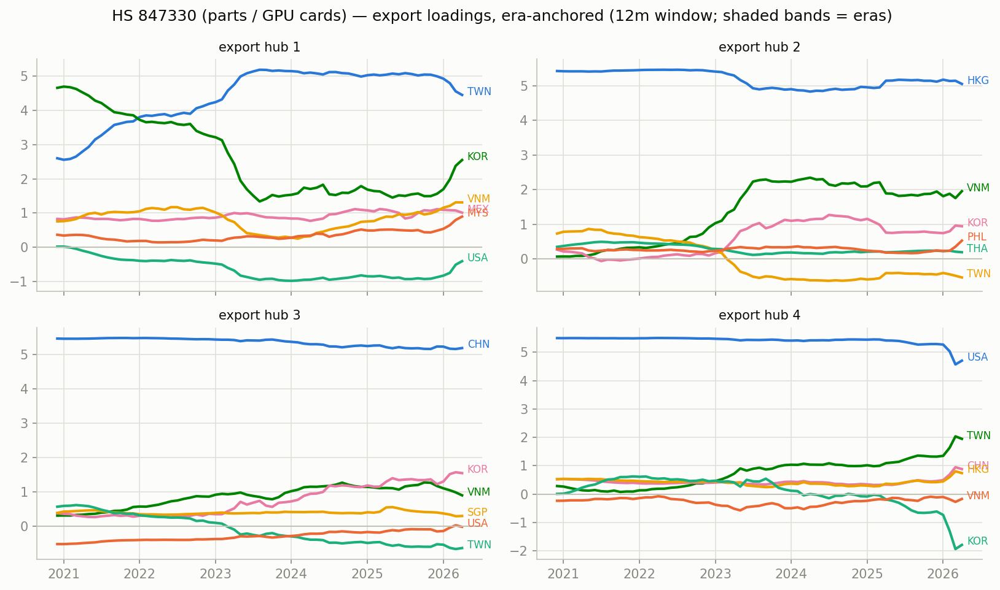
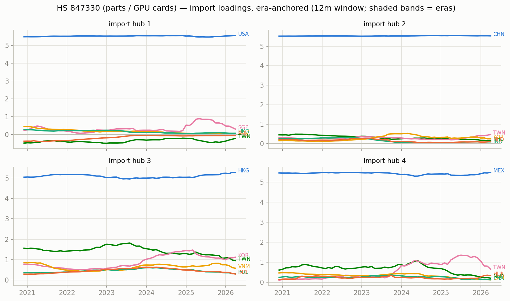
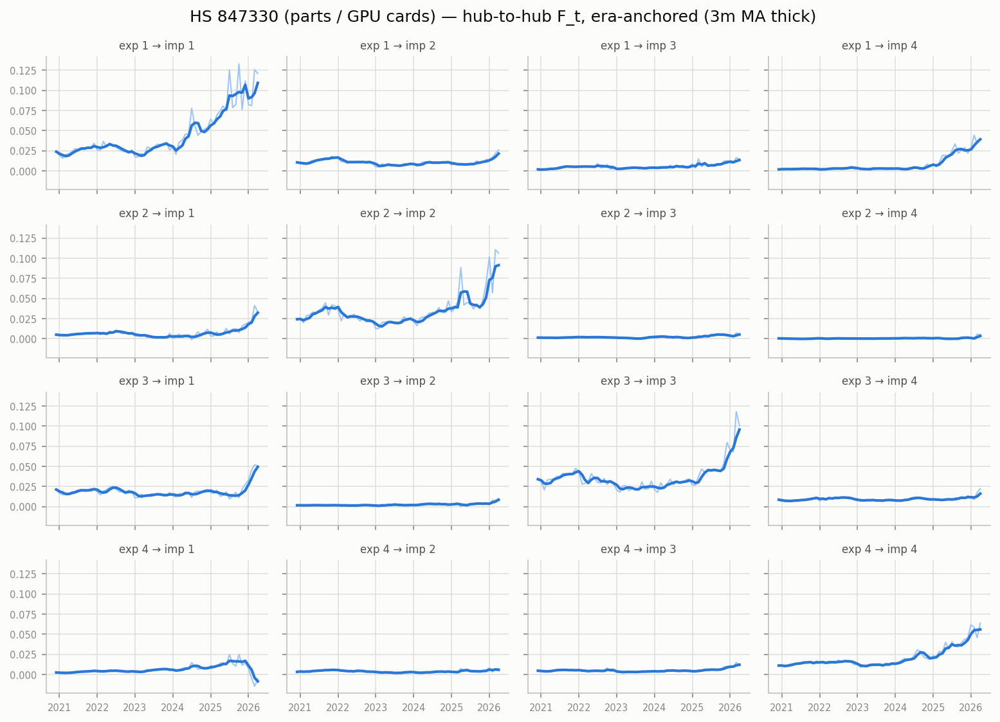

# Era-anchored time-varying MFM — HS 847330 (parts / GPU cards), monthly panel

12m trailing loadings, k=r=4, $B levels; months aligned to per-era constant anchors (Procrustes), no chained matching. In-sample R^2 0.951; mean within-era loading step 0.025 (superseded chained version: ../archive/ai_compute_chained).

## Era 0: 2020-12 .. 2026-04

- export hub 1 (TWN-led, serves USA-hub): TWN +4.66, KOR +2.32, VNM +1.17, MEX +1.01, MYS +0.72, USA -0.61
- export hub 2 (HKG-led, serves CHN-hub): HKG +5.17, VNM +1.68, KOR +0.96, TWN -0.45, PHL +0.40, CHN -0.29
- export hub 3 (CHN-led, serves HKG-hub): CHN +5.30, KOR +1.31, VNM +0.84, TWN -0.46, SGP +0.33, HKG -0.29
- export hub 4 (USA-led, serves MEX-hub): USA +5.10, TWN +1.57, KOR -1.19, CHN +0.67, HKG +0.60, MEX -0.43

## Cross-era hub crosswalk (|cosine| between anchor loadings, rows = earlier era hub, cols = later era hub)

## Figures

_Generated by `scripts/tvmfm_monthly_anchored.py`._