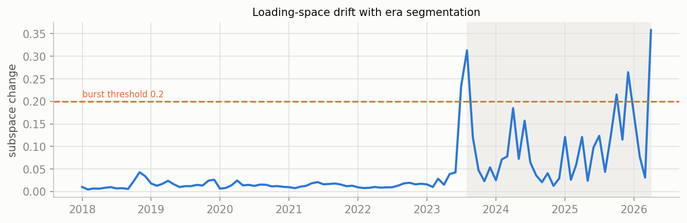
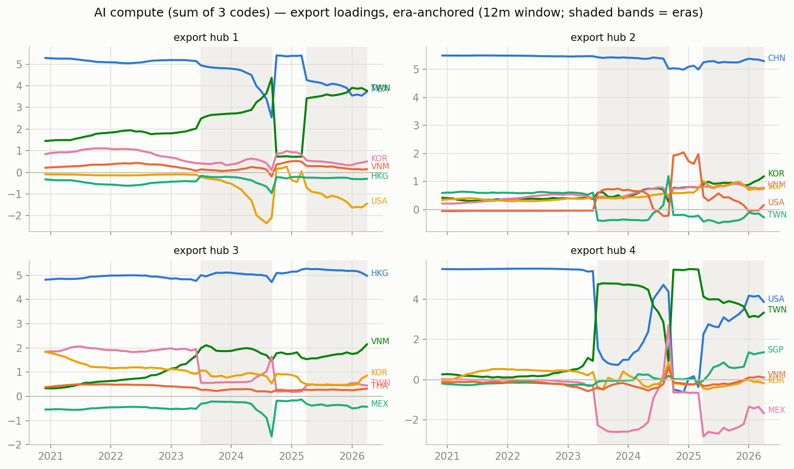

# Era-anchored time-varying MFM — AI compute (sum of 3 codes), monthly panel

12m trailing loadings, k=r=4, $B levels; months aligned to per-era constant anchors (Procrustes), no chained matching. In-sample R^2 0.976; mean within-era loading step 0.042 (superseded chained version: ../archive/ai_compute_chained).

## Era 0: 2020-12 .. 2023-06

- export hub 1 (MEX-led, serves USA-hub): MEX +5.13, TWN +1.92, KOR +0.75, HKG -0.50, VNM +0.28, MYS +0.22
- export hub 2 (CHN-led, serves HKG-hub): CHN +5.48, TWN +0.59, VNM +0.43, KOR +0.40, SGP +0.35, MYS +0.30
- export hub 3 (HKG-led, serves CHN-hub): HKG +4.93, TWN +1.91, KOR +1.16, VNM +0.94, MEX -0.49, THA +0.45
- export hub 4 (USA-led, serves MEX-hub): USA +5.51, TWN +0.43, KOR +0.40, CZE +0.28, VNM -0.21, SGP -0.20

## Era 1: 2023-07 .. 2024-09

- export hub 1 (MEX-led, serves USA-hub): MEX +4.21, TWN +3.08, USA -1.74, KOR +0.63, HKG -0.44, VNM +0.25
- export hub 2 (CHN-led, serves HKG-hub): CHN +5.39, KOR +0.80, VNM +0.80, SGP +0.54, MYS +0.45, TWN -0.21
- export hub 3 (HKG-led, serves CHN-hub): HKG +5.05, VNM +1.81, KOR +0.87, TWN +0.78, USA -0.54, MEX -0.53
- export hub 4 (TWN-led, serves USA-hub): TWN +4.00, USA +3.54, MEX -1.38, VNM -0.46, KOR -0.41, CZE +0.19

## Era 2: 2024-10 .. 2025-03

- export hub 1 (MEX-led, serves USA-hub): MEX +5.22, USA -1.48, TWN +0.86, KOR +0.69, VNM +0.50, MYS +0.24
- export hub 2 (CHN-led, serves HKG-hub): CHN +5.41, VNM +0.75, KOR +0.69, SGP +0.69, USA +0.31, MYS +0.23
- export hub 3 (HKG-led, serves CHN-hub): HKG +5.29, VNM +1.49, USA -0.54, KOR +0.38, TWN +0.29, MYS +0.28
- export hub 4 (TWN-led, serves USA-hub): TWN +5.30, USA +1.60, MEX -0.44, MYS +0.27, HKG -0.14, VNM -0.09

## Era 3: 2025-04 .. 2026-04

- export hub 1 (TWN-led, serves USA-hub): TWN +3.77, MEX +3.72, USA -1.45, KOR +0.50, SGP -0.49, THA +0.42
- export hub 2 (CHN-led, serves HKG-hub): CHN +5.29, KOR +1.16, SGP +0.80, VNM +0.78, MYS +0.35, MEX +0.32
- export hub 3 (HKG-led, serves CHN-hub): HKG +5.05, VNM +2.03, KOR +0.76, TWN +0.45, MEX -0.41, PHL +0.34
- export hub 4 (USA-led, serves USA-hub): USA +3.88, TWN +3.32, MEX -1.65, SGP +1.41, THA -0.21, MYS +0.20

## Cross-era hub crosswalk (|cosine| between anchor loadings, rows = earlier era hub, cols = later era hub)

### era 0 -> era 1

| | hub 1' | hub 2' | hub 3' | hub 4' |
|---|---|---|---|---|
| hub 1 | 0.92 | 0.01 | 0.08 | 0.01 |
| hub 2 | 0.04 | 0.98 | 0.01 | 0.10 |
| hub 3 | 0.10 | 0.02 | 0.96 | 0.20 |
| hub 4 | 0.27 | 0.02 | 0.10 | 0.69 |

### era 1 -> era 2

| | hub 1' | hub 2' | hub 3' | hub 4' |
|---|---|---|---|---|
| hub 1 | 0.90 | 0.02 | 0.02 | 0.38 |
| hub 2 | 0.04 | 1.00 | 0.00 | 0.03 |
| hub 3 | 0.02 | 0.01 | 0.99 | 0.09 |
| hub 4 | 0.30 | 0.05 | 0.07 | 0.89 |

### era 2 -> era 3

| | hub 1' | hub 2' | hub 3' | hub 4' |
|---|---|---|---|---|
| hub 1 | 0.82 | 0.08 | 0.02 | 0.37 |
| hub 2 | 0.04 | 0.99 | 0.00 | 0.06 |
| hub 3 | 0.00 | 0.01 | 0.99 | 0.05 |
| hub 4 | 0.52 | 0.05 | 0.04 | 0.79 |

## Figures

_Generated by `scripts/tvmfm_monthly_anchored.py`._