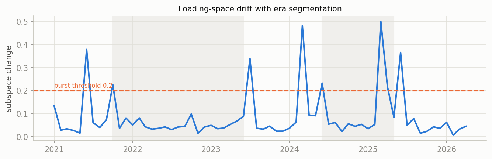
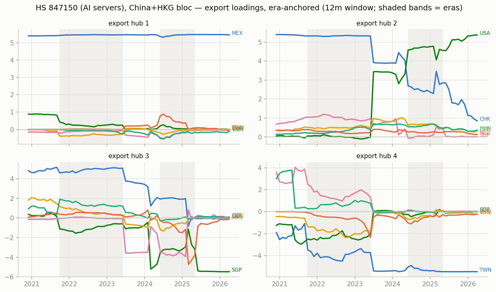
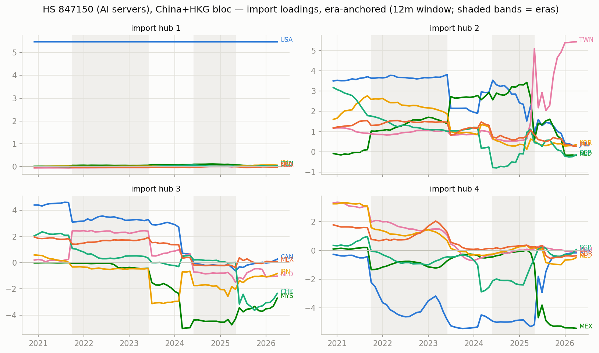
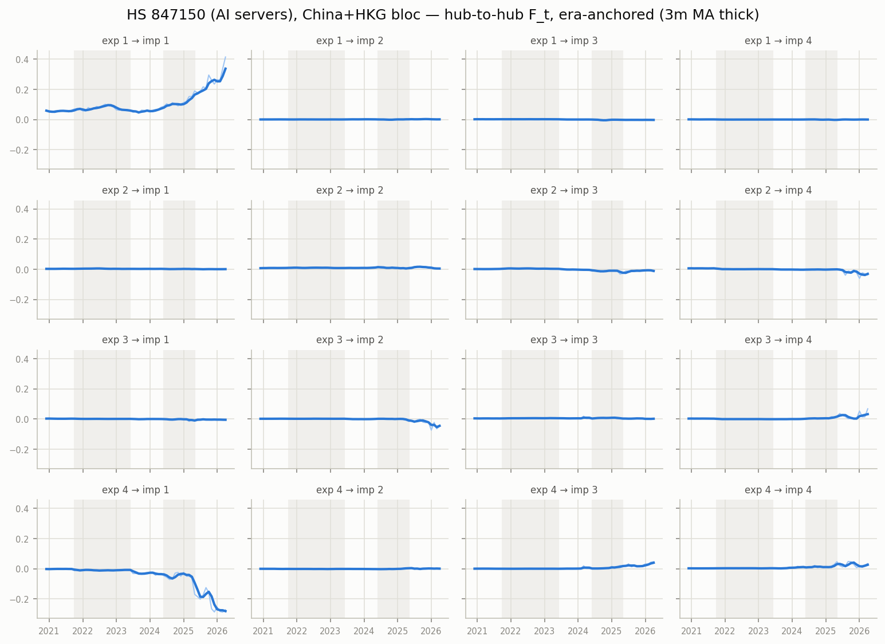

# Era-anchored time-varying MFM — HS 847150 (AI servers), China+HKG bloc, monthly panel

12m trailing loadings, k=r=4, $B levels; months aligned to per-era constant anchors (Procrustes), no chained matching. In-sample R^2 0.988; mean within-era loading step 0.079 (superseded chained version: ../../archive/ai_compute_chained).

## Era 0: 2020-12 .. 2021-09

- export hub 1 (MEX-led, serves USA-hub): MEX +5.41, TWN +0.81, USA -0.15, SGP -0.10, DEU +0.09, CZE +0.08
- export hub 2 (CHK-led, serves JPN-hub): CHK +5.32, SGP +1.07, CZE +0.54, NLD +0.39, HUN +0.24, GBR +0.15
- export hub 3 (USA-led, serves CAN-hub): USA +5.13, TWN +1.58, MYS +0.59, THA +0.45, DEU +0.43, CZE +0.35
- export hub 4 (CZE-led, serves DEU-hub): CZE +3.65, SGP -2.96, HUN +1.63, TWN -1.30, NLD +1.14, DEU +0.83

## Era 1: 2021-10 .. 2023-06

- export hub 1 (MEX-led, serves USA-hub): MEX +5.46, SGP -0.27, TWN +0.21, VNM -0.17, CZE +0.14, POL +0.10
- export hub 2 (CHK-led, serves JPN-hub): CHK +5.34, SGP +0.92, CZE +0.53, HUN +0.34, VNM -0.29, NLD +0.25
- export hub 3 (USA-led, serves CAN-hub): USA +5.14, CZE +1.14, HUN +0.69, SGP -0.68, POL +0.56, DEU +0.52
- export hub 4 (TWN-led, serves USA-hub): TWN -4.07, MYS -2.11, SGP -2.00, VNM -1.40, CZE +1.23, THA -0.80

## Era 2: 2023-07 .. 2024-05

- export hub 1 (MEX-led, serves USA-hub): MEX +5.41, VNM -0.44, USA -0.36, MYS -0.34, CHK +0.31, NLD +0.23
- export hub 2 (CHK-led, serves NLD-hub): CHK +4.04, USA +3.32, CZE +0.95, THA +0.66, HUN +0.63, MYS +0.60
- export hub 3 (SGP-led, serves MYS-hub): SGP -4.69, USA +2.01, CHK -1.58, THA +0.83, MYS +0.45, VNM +0.37
- export hub 4 (TWN-led, serves USA-hub): TWN -5.24, VNM -0.88, MYS -0.82, THA -0.56, CHK +0.52, USA -0.48

## Era 3: 2024-06 .. 2025-05

- export hub 1 (MEX-led, serves USA-hub): MEX +5.47, VNM -0.17, HUN +0.14, CHK +0.09, MYS +0.08, USA -0.07
- export hub 2 (USA-led, serves MYS-hub): USA +4.56, CHK +2.85, SGP +0.49, VNM -0.48, HUN +0.44, CZE +0.42
- export hub 3 (MYS-led, serves CHK-hub): MYS -3.80, SGP -3.17, VNM -2.17, THA -0.85, HUN -0.20, CHK +0.09
- export hub 4 (TWN-led, serves USA-hub): TWN -5.47, VNM -0.26, HUN +0.14, THA -0.12, MYS +0.12, NLD +0.04

## Era 4: 2025-06 .. 2026-04

- export hub 1 (MEX-led, serves USA-hub): MEX +5.45, THA +0.51, HUN +0.20, MYS -0.10, IRL +0.10, CZE +0.06
- export hub 2 (USA-led, serves MEX-hub): USA +5.41, CHK +0.64, HUN +0.35, CZE +0.32, IRL +0.28, NLD +0.11
- export hub 3 (SGP-led, serves TWN-hub): SGP -5.47, MYS -0.12, CZE +0.10, IRL +0.09, HUN +0.07, GBR +0.04
- export hub 4 (TWN-led, serves USA-hub): TWN -5.47, MYS -0.18, VNM -0.14, CHK -0.13, HUN +0.07, IRL +0.05

## Cross-era hub crosswalk (|cosine| between anchor loadings, rows = earlier era hub, cols = later era hub)

### era 0 -> era 1

| | hub 1' | hub 2' | hub 3' | hub 4' |
|---|---|---|---|---|
| hub 1 | 0.99 | 0.00 | 0.01 | 0.11 |
| hub 2 | 0.00 | 1.00 | 0.00 | 0.04 |
| hub 3 | 0.02 | 0.00 | 0.94 | 0.29 |
| hub 4 | 0.05 | 0.02 | 0.29 | 0.63 |

### era 1 -> era 2

| | hub 1' | hub 2' | hub 3' | hub 4' |
|---|---|---|---|---|
| hub 1 | 0.99 | 0.01 | 0.06 | 0.04 |
| hub 2 | 0.06 | 0.75 | 0.42 | 0.10 |
| hub 3 | 0.07 | 0.64 | 0.50 | 0.16 |
| hub 4 | 0.04 | 0.03 | 0.29 | 0.85 |

### era 2 -> era 3

| | hub 1' | hub 2' | hub 3' | hub 4' |
|---|---|---|---|---|
| hub 1 | 0.99 | 0.02 | 0.10 | 0.02 |
| hub 2 | 0.02 | 0.92 | 0.14 | 0.02 |
| hub 3 | 0.02 | 0.09 | 0.38 | 0.04 |
| hub 4 | 0.01 | 0.02 | 0.22 | 0.96 |

### era 3 -> era 4

| | hub 1' | hub 2' | hub 3' | hub 4' |
|---|---|---|---|---|
| hub 1 | 0.99 | 0.01 | 0.00 | 0.00 |
| hub 2 | 0.00 | 0.90 | 0.09 | 0.01 |
| hub 3 | 0.00 | 0.02 | 0.59 | 0.03 |
| hub 4 | 0.00 | 0.00 | 0.00 | 1.00 |

## Figures

_Generated by `scripts/tvmfm_monthly_anchored.py`._