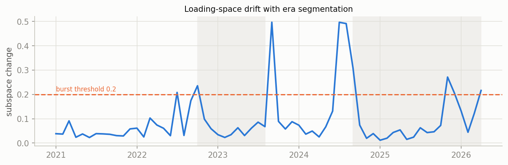
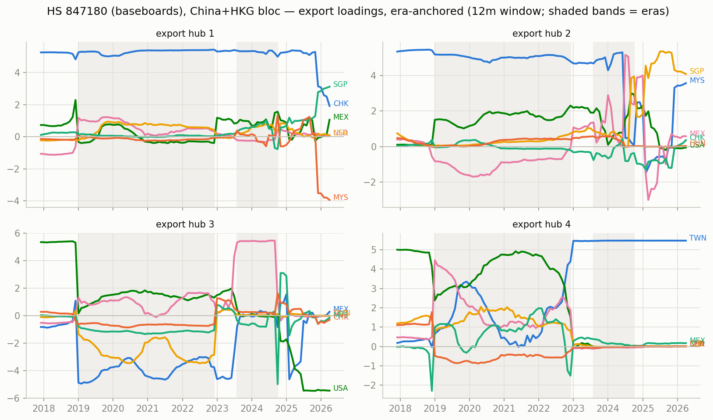
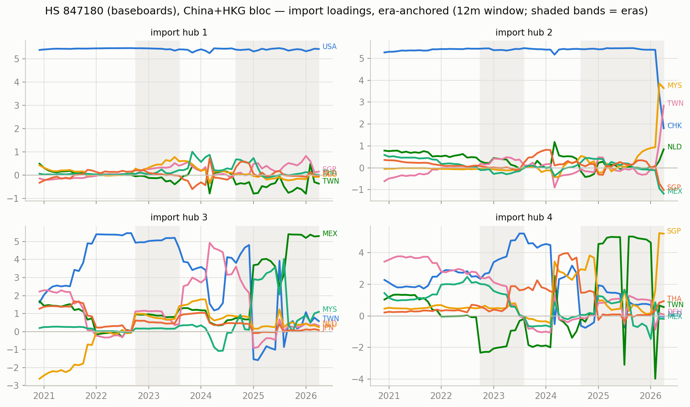
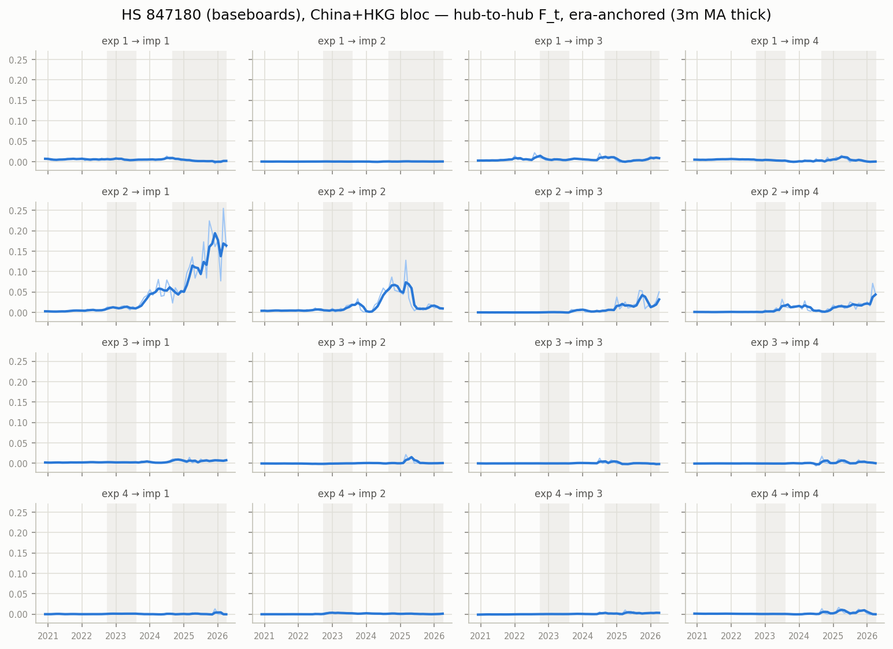

# Era-anchored time-varying MFM — HS 847180 (baseboards), China+HKG bloc, monthly panel

12m trailing loadings, k=r=4, $B levels; months aligned to per-era constant anchors (Procrustes), no chained matching. In-sample R^2 0.988; mean within-era loading step 0.127 (superseded chained version: ../archive/ai_compute_chained).

## Era 0: 2020-12 .. 2022-09

- export hub 1 (CHK-led, serves USA-hub): CHK +5.47, USA +0.15, MYS +0.10, VNM +0.10, MEX +0.06, DEU +0.05
- export hub 2 (TWN-led, serves CHK-hub): TWN +5.01, MYS +1.85, USA +0.66, VNM +0.63, MEX +0.57, SGP +0.28
- export hub 3 (MEX-led, serves USA-hub): MEX +4.08, USA -2.21, VNM +2.05, MYS -1.91, CAN +0.48, NLD +0.35
- export hub 4 (NLD-led, serves DEU-hub): NLD +4.48, USA +2.13, CZE +1.65, MYS -0.75, DEU +0.73, FRA +0.71

## Era 1: 2022-10 .. 2023-08

- export hub 1 (CHK-led, serves USA-hub): CHK +5.42, USA +0.44, NLD +0.38, SGP +0.25, MEX +0.23, VNM +0.22
- export hub 2 (TWN-led, serves USA-hub): TWN +5.48, NLD +0.07, USA +0.04, DEU +0.04, VNM +0.03, SGP -0.03
- export hub 3 (MEX-led, serves USA-hub): MEX +4.02, USA -2.55, VNM +2.22, NLD -1.25, CAN +0.55, CZE -0.41
- export hub 4 (MYS-led, serves CHK-hub): MYS +4.86, USA +2.09, SGP +0.79, THA +0.66, MEX +0.58, VNM +0.58

## Era 2: 2023-09 .. 2024-08

- export hub 1 (CHK-led, serves TWN-hub): CHK +5.45, NLD +0.47, SGP +0.25, CZE +0.13, VNM +0.12, HUN +0.11
- export hub 2 (TWN-led, serves USA-hub): TWN +5.47, MYS +0.14, VNM +0.10, NLD +0.03, SGP +0.03, THA +0.03
- export hub 3 (MEX-led, serves USA-hub): MEX +5.47, VNM +0.19, SGP -0.18, NLD +0.13, DEU -0.07, HUN -0.07
- export hub 4 (USA-led, serves CHK-hub): USA +5.35, SGP +0.74, NLD -0.72, MYS +0.52, HUN +0.09, DEU +0.08

## Era 3: 2024-09 .. 2026-04

- export hub 1 (CHK-led, serves MEX-hub): CHK +5.27, USA +1.12, SGP -0.85, VNM +0.28, NLD +0.19, MEX +0.19
- export hub 2 (TWN-led, serves USA-hub): TWN +5.48, MYS +0.07, VNM +0.07, SGP -0.02, USA +0.02, THA +0.01
- export hub 3 (MEX-led, serves USA-hub): MEX +5.26, USA -1.17, SGP +0.84, MYS +0.35, VNM +0.30, CHK +0.18
- export hub 4 (SGP-led, serves SGP-hub): SGP +4.15, USA +3.53, MYS +0.48, VNM +0.20, CHK -0.09, POL +0.08

## Cross-era hub crosswalk (|cosine| between anchor loadings, rows = earlier era hub, cols = later era hub)

### era 0 -> era 1

| | hub 1' | hub 2' | hub 3' | hub 4' |
|---|---|---|---|---|
| hub 1 | 0.99 | 0.01 | 0.02 | 0.01 |
| hub 2 | 0.00 | 0.92 | 0.09 | 0.39 |
| hub 3 | 0.03 | 0.06 | 0.87 | 0.35 |
| hub 4 | 0.11 | 0.02 | 0.35 | 0.03 |

### era 1 -> era 2

| | hub 1' | hub 2' | hub 3' | hub 4' |
|---|---|---|---|---|
| hub 1 | 1.00 | 0.00 | 0.04 | 0.08 |
| hub 2 | 0.00 | 1.00 | 0.01 | 0.00 |
| hub 3 | 0.00 | 0.01 | 0.74 | 0.42 |
| hub 4 | 0.01 | 0.02 | 0.10 | 0.48 |

### era 2 -> era 3

| | hub 1' | hub 2' | hub 3' | hub 4' |
|---|---|---|---|---|
| hub 1 | 0.96 | 0.00 | 0.04 | 0.02 |
| hub 2 | 0.00 | 1.00 | 0.00 | 0.01 |
| hub 3 | 0.04 | 0.00 | 0.95 | 0.01 |
| hub 4 | 0.18 | 0.00 | 0.18 | 0.74 |

## Figures

_Generated by `scripts/tvmfm_monthly_anchored.py`._