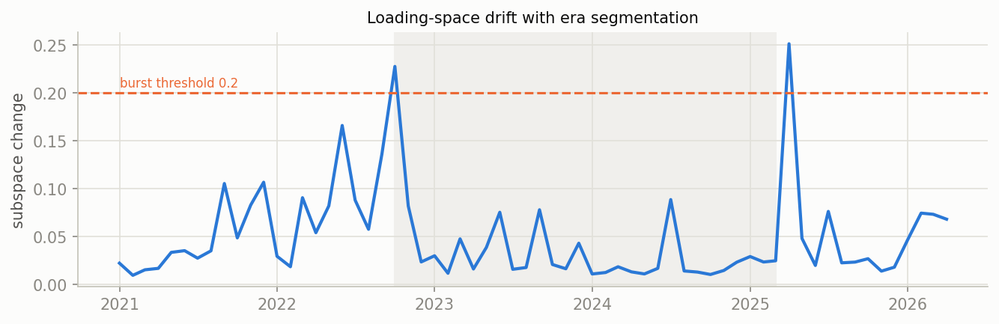
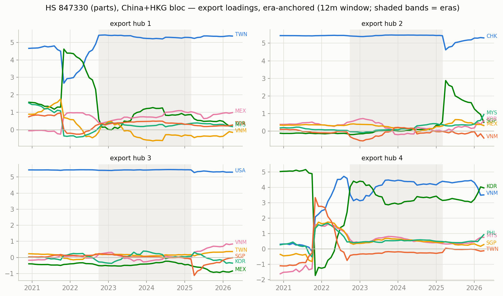
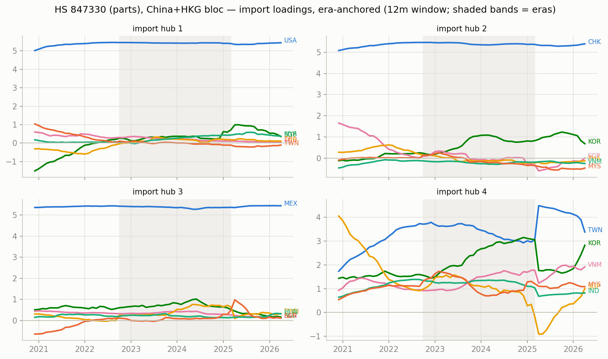
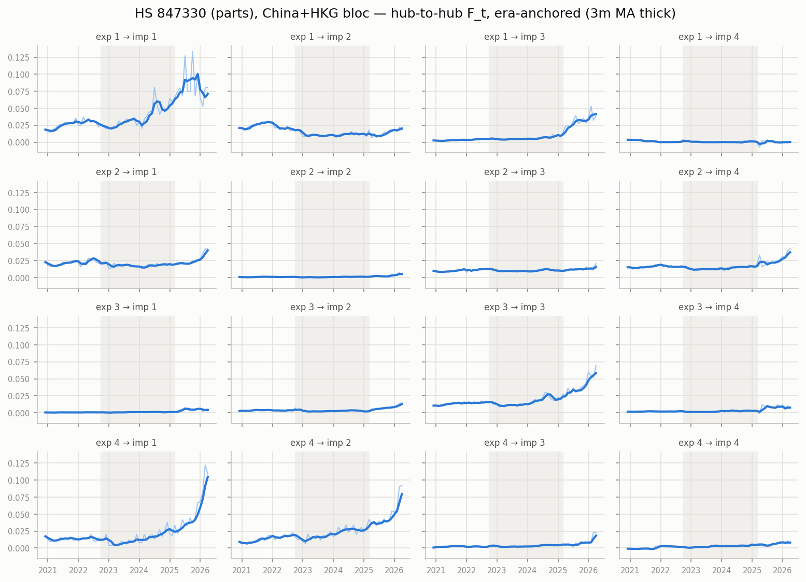

# Era-anchored time-varying MFM — HS 847330 (parts), China+HKG bloc, monthly panel

12m trailing loadings, k=r=4, $B levels; months aligned to per-era constant anchors (Procrustes), no chained matching. In-sample R^2 0.961; mean within-era loading step 0.057 (superseded chained version: ../archive/ai_compute_chained).

## Era 0: 2020-12 .. 2022-09

- export hub 1 (TWN-led, serves USA-hub): TWN +4.72, KOR +2.61, VNM -0.59, MEX +0.58, THA +0.34, PHL +0.27
- export hub 2 (CHK-led, serves USA-hub): CHK +5.42, KOR +0.49, MEX +0.37, THA -0.28, JPN -0.21, SGP -0.18
- export hub 3 (USA-led, serves MEX-hub): USA +5.44, MEX -0.46, PHL +0.20, SGP +0.19, THA +0.18, JPN +0.18
- export hub 4 (VNM-led, serves CHK-hub): VNM +4.81, KOR +2.04, MYS +0.93, SGP +0.67, TWN -0.55, PHL +0.54

## Era 1: 2022-10 .. 2025-03

- export hub 1 (TWN-led, serves USA-hub): TWN +5.28, MEX +0.99, KOR +0.86, MYS +0.36, VNM -0.33, THA +0.32
- export hub 2 (CHK-led, serves USA-hub): CHK +5.46, SGP +0.21, MYS +0.18, MEX +0.15, KOR +0.13, NLD +0.12
- export hub 3 (USA-led, serves MEX-hub): USA +5.45, MEX -0.44, TWN +0.17, THA -0.11, MYS +0.09, CAN -0.07
- export hub 4 (VNM-led, serves CHK-hub): VNM +4.34, KOR +3.19, PHL +0.50, SGP +0.48, MYS +0.44, THA +0.34

## Era 2: 2025-04 .. 2026-04

- export hub 1 (TWN-led, serves USA-hub): TWN +5.37, MEX +0.96, THA +0.26, KOR +0.25, PHL -0.20, MYS +0.19
- export hub 2 (CHK-led, serves TWN-hub): CHK +5.27, MYS +0.91, SGP +0.85, KOR +0.55, VNM -0.39, MEX +0.33
- export hub 3 (USA-led, serves MEX-hub): USA +5.31, MEX -0.84, VNM +0.82, TWN +0.36, KOR -0.33, PHL +0.24
- export hub 4 (KOR-led, serves USA-hub): KOR +3.97, VNM +3.52, PHL +0.90, MYS +0.74, THA +0.49, CHK -0.30

## Cross-era hub crosswalk (|cosine| between anchor loadings, rows = earlier era hub, cols = later era hub)

### era 0 -> era 1

| | hub 1' | hub 2' | hub 3' | hub 4' |
|---|---|---|---|---|
| hub 1 | 0.93 | 0.01 | 0.01 | 0.16 |
| hub 2 | 0.00 | 0.99 | 0.00 | 0.03 |
| hub 3 | 0.00 | 0.01 | 1.00 | 0.00 |
| hub 4 | 0.09 | 0.01 | 0.01 | 0.96 |

### era 1 -> era 2

| | hub 1' | hub 2' | hub 3' | hub 4' |
|---|---|---|---|---|
| hub 1 | 0.99 | 0.02 | 0.00 | 0.07 |
| hub 2 | 0.01 | 0.98 | 0.03 | 0.04 |
| hub 3 | 0.01 | 0.01 | 0.98 | 0.05 |
| hub 4 | 0.04 | 0.02 | 0.08 | 0.97 |

## Figures

_Generated by `scripts/tvmfm_monthly_anchored.py`._