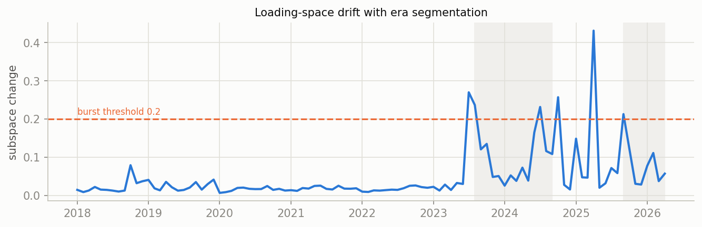
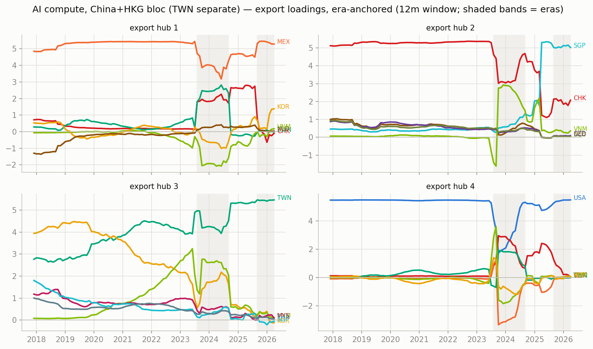
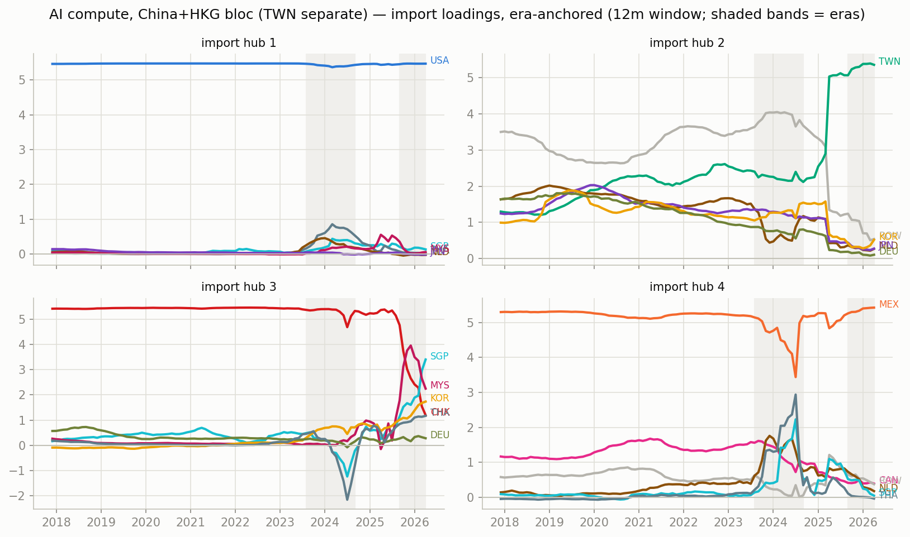
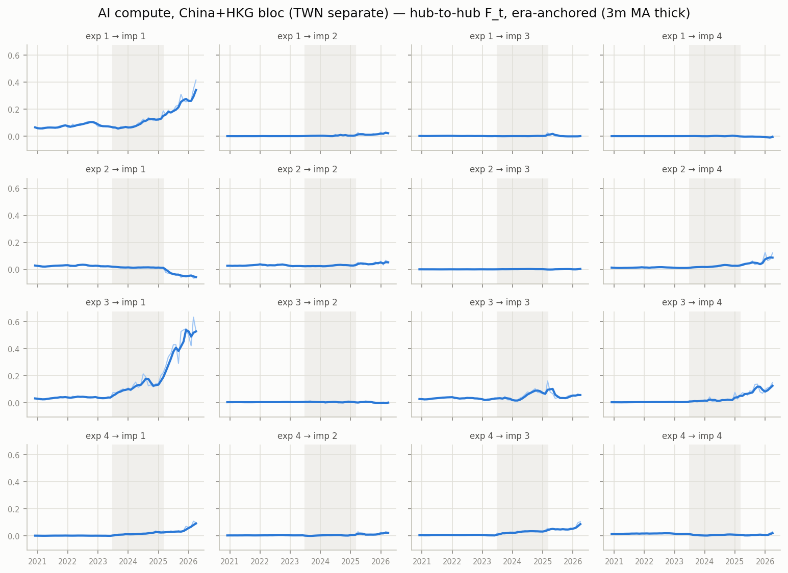

# Era-anchored time-varying MFM — AI compute, China+HKG bloc (TWN separate), monthly panel

12m trailing loadings, k=r=4, $B levels; months aligned to per-era constant anchors (Procrustes), no chained matching. In-sample R^2 0.982; mean within-era loading step 0.039 (superseded chained version: ../archive/ai_compute_chained).

## Era 0: 2020-12 .. 2023-06

- export hub 1 (MEX-led, serves USA-hub): MEX +5.40, VNM -0.52, SGP -0.44, TWN +0.39, MYS -0.23, JPN -0.18
- export hub 2 (CHK-led, serves TWN-hub): CHK +5.43, SGP +0.40, NLD +0.32, CZE +0.31, DEU +0.18, HUN +0.14
- export hub 3 (TWN-led, serves USA-hub): TWN +4.16, KOR +2.46, VNM +2.06, MYS +1.04, SGP +0.68, THA +0.68
- export hub 4 (USA-led, serves MEX-hub): USA +5.44, SGP -0.48, VNM -0.27, KOR +0.24, NLD -0.22, MYS -0.10

## Era 1: 2023-07 .. 2025-03

- export hub 1 (MEX-led, serves USA-hub): MEX +5.36, USA -0.84, KOR +0.53, CHK +0.45, VNM -0.15, SGP -0.13
- export hub 2 (CHK-led, serves MEX-hub): CHK +4.45, USA +3.10, SGP +0.59, VNM -0.25, MYS +0.23, CZE +0.23
- export hub 3 (TWN-led, serves USA-hub): TWN +5.47, THA +0.14, MYS +0.06, KOR -0.06, NLD +0.04, SGP -0.02
- export hub 4 (VNM-led, serves CHK-hub): VNM +4.38, KOR +2.74, MYS +1.25, SGP +0.83, USA +0.72, CHK -0.46

## Era 2: 2025-04 .. 2026-04

- export hub 1 (MEX-led, serves USA-hub): MEX +5.07, SGP +1.29, USA -1.21, CHK +0.62, THA +0.55, VNM -0.48
- export hub 2 (USA-led, serves MEX-hub): USA +3.88, SGP +3.22, CHK +2.11, MYS +0.22, MEX -0.17, VNM -0.12
- export hub 3 (TWN-led, serves USA-hub): TWN +5.35, SGP -0.87, USA +0.71, MEX +0.24, VNM +0.16, CHK -0.16
- export hub 4 (VNM-led, serves USA-hub): VNM +4.16, KOR +3.14, MYS +0.90, PHL +0.82, THA +0.79, SGP +0.58

## Cross-era hub crosswalk (|cosine| between anchor loadings, rows = earlier era hub, cols = later era hub)

### era 0 -> era 1

| | hub 1' | hub 2' | hub 3' | hub 4' |
|---|---|---|---|---|
| hub 1 | 0.97 | 0.01 | 0.07 | 0.12 |
| hub 2 | 0.09 | 0.82 | 0.01 | 0.07 |
| hub 3 | 0.06 | 0.01 | 0.76 | 0.60 |
| hub 4 | 0.15 | 0.56 | 0.02 | 0.09 |

### era 1 -> era 2

| | hub 1' | hub 2' | hub 3' | hub 4' |
|---|---|---|---|---|
| hub 1 | 0.95 | 0.12 | 0.02 | 0.02 |
| hub 2 | 0.02 | 0.78 | 0.03 | 0.04 |
| hub 3 | 0.03 | 0.01 | 0.98 | 0.01 |
| hub 4 | 0.03 | 0.14 | 0.02 | 0.96 |

## Figures

_Generated by `scripts/tvmfm_monthly_anchored.py`._