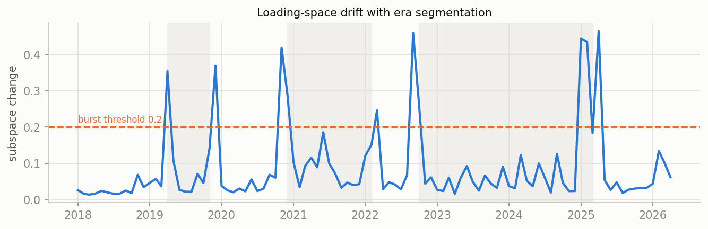
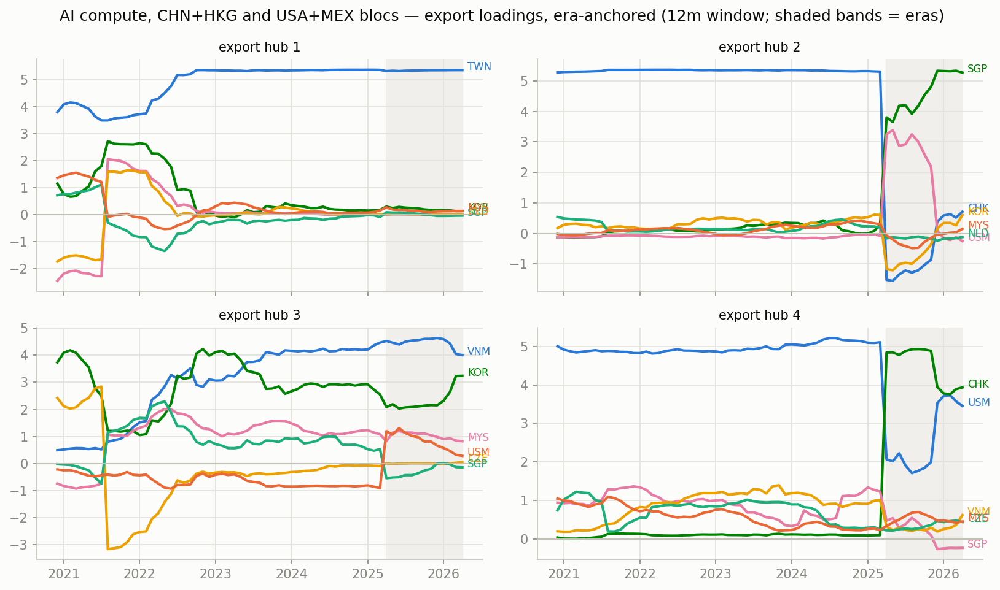
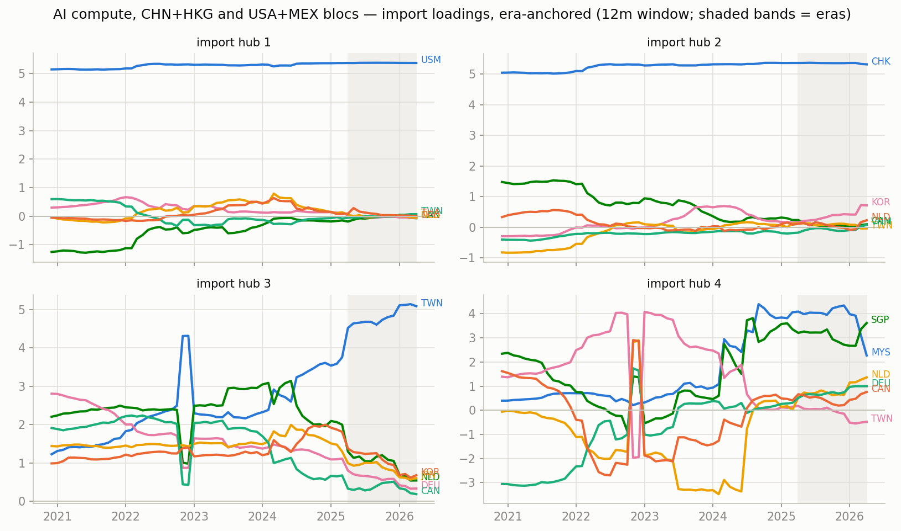
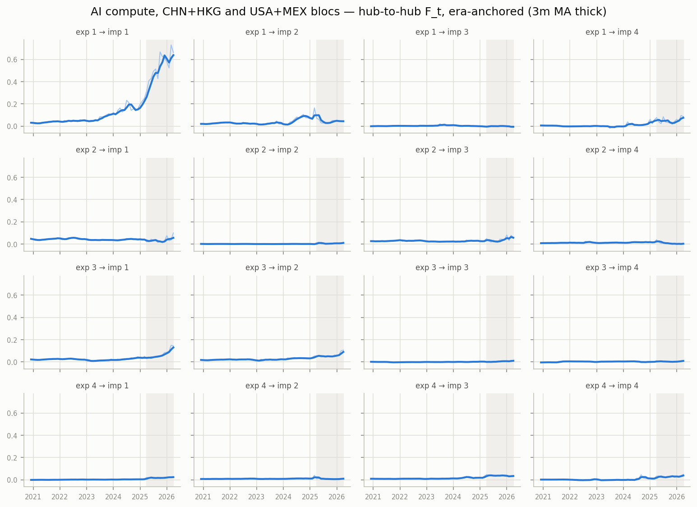

# Era-anchored time-varying MFM — AI compute, CHN+HKG and USA+MEX blocs, monthly panel

12m trailing loadings, k=r=4, $B levels; months aligned to per-era constant anchors (Procrustes), no chained matching. In-sample R^2 0.989; mean within-era loading step 0.072 (superseded chained version: ../archive/ai_compute_chained).

## Era 0: 2020-12 .. 2025-03

- export hub 1 (TWN-led, serves USM-hub): TWN +5.38, MYS +0.17, THA +0.14, NLD +0.06, VNM +0.05, KOR -0.04
- export hub 2 (CHK-led, serves USM-hub): CHK +5.31, KOR +0.69, VNM -0.41, NLD +0.19, DEU +0.16, CZE +0.14
- export hub 3 (KOR-led, serves CHK-hub): KOR +3.81, VNM +3.47, MYS +1.11, PHL +0.56, USM -0.53, THA +0.46
- export hub 4 (USM-led, serves TWN-hub): USM +4.97, SGP +1.26, VNM +1.24, KOR -0.73, CZE +0.44, MYS +0.43

## Era 1: 2025-04 .. 2026-04

- export hub 1 (TWN-led, serves USM-hub): TWN +5.37, CHK +0.29, THA +0.23, USM -0.15, MYS +0.14, KOR +0.14
- export hub 2 (SGP-led, serves TWN-hub): SGP +5.27, CHK +0.73, KOR +0.58, USM -0.28, VNM -0.25, THA +0.22
- export hub 3 (VNM-led, serves USM-hub): VNM +4.03, KOR +3.21, PHL +0.83, THA +0.82, MYS +0.82, CHK -0.53
- export hub 4 (CHK-led, serves TWN-hub): CHK +3.75, USM +3.65, VNM +0.61, KOR -0.51, MYS +0.47, CZE +0.43

## Cross-era hub crosswalk (|cosine| between anchor loadings, rows = earlier era hub, cols = later era hub)

### era 0 -> era 1

| | hub 1' | hub 2' | hub 3' | hub 4' |
|---|---|---|---|---|
| hub 1 | 1.00 | 0.01 | 0.00 | 0.01 |
| hub 2 | 0.06 | 0.16 | 0.07 | 0.67 |
| hub 3 | 0.01 | 0.14 | 0.96 | 0.09 |
| hub 4 | 0.03 | 0.16 | 0.16 | 0.69 |

## Figures

_Generated by `scripts/tvmfm_monthly_anchored.py`._