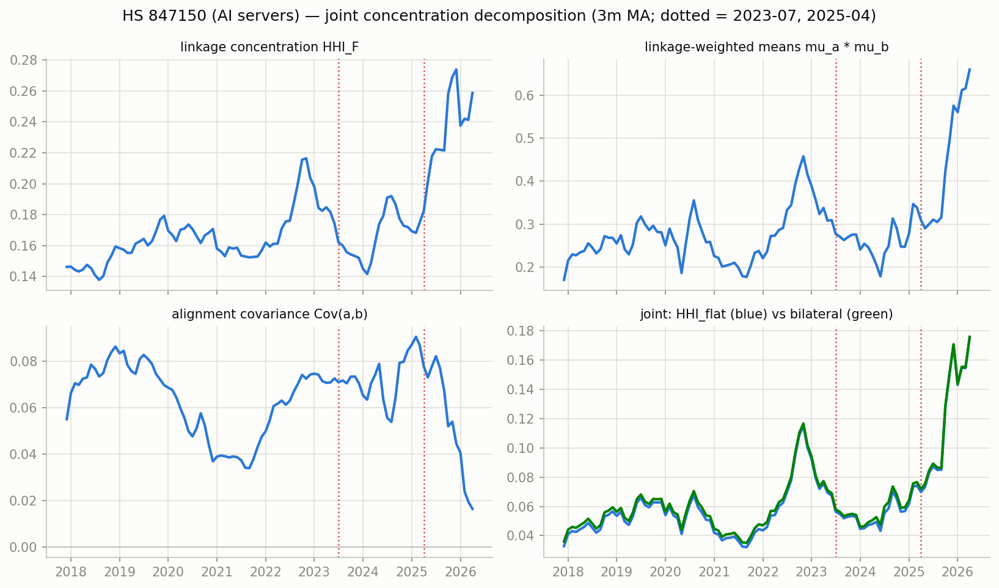
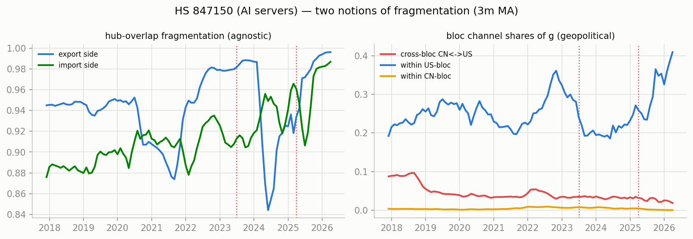
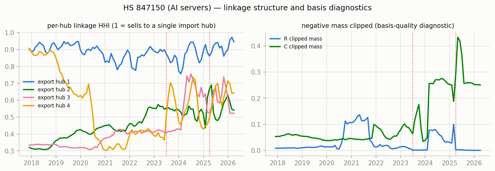

# Network concentration & fragmentation — HS 847150 (AI servers)

Measures per docs/concentration-fragmentation-nnf-mfm-trade.md, computed monthly from the era-anchored TV-MFM (CHN+HKG bloc, NNF basis, clipped shares). Full series in `series.csv`.

Coverage 2017-12 .. 2026-04 (101 months). Mean clipped negative mass: R 0.029, C 0.114 (max 0.434).

## Readings around the structural breaks (3m before vs 3m from the break)

### 2023-07 (H100 ramp)

| measure | before | after | change |
|---|---|---|---|
| hhi_F | 0.1744 | 0.1558 | -0.0186 |
| aligncov | 0.0725 | 0.0704 | -0.0021 |
| hhi_flat | 0.0674 | 0.0519 | -0.0155 |
| hhi_bilat | 0.0690 | 0.0533 | -0.0157 |
| frag_exp | 0.9798 | 0.9879 | +0.0082 |
| crossbloc_cnus | 0.0345 | 0.0365 | +0.0020 |
| within_us | 0.2809 | 0.1928 | -0.0881 |
| within_cn | 0.0075 | 0.0071 | -0.0004 |

### 2025-04 (tariffs)

| measure | before | after | change |
|---|---|---|---|
| hhi_F | 0.1748 | 0.2178 | +0.0430 |
| aligncov | 0.0868 | 0.0777 | -0.0091 |
| hhi_flat | 0.0742 | 0.0830 | +0.0088 |
| hhi_bilat | 0.0766 | 0.0846 | +0.0080 |
| frag_exp | 0.9183 | 0.9710 | +0.0528 |
| crossbloc_cnus | 0.0347 | 0.0258 | -0.0089 |
| within_us | 0.2714 | 0.2355 | -0.0360 |
| within_cn | 0.0049 | 0.0029 | -0.0020 |

## Figures

_Generated by `scripts/network_stats.py`._