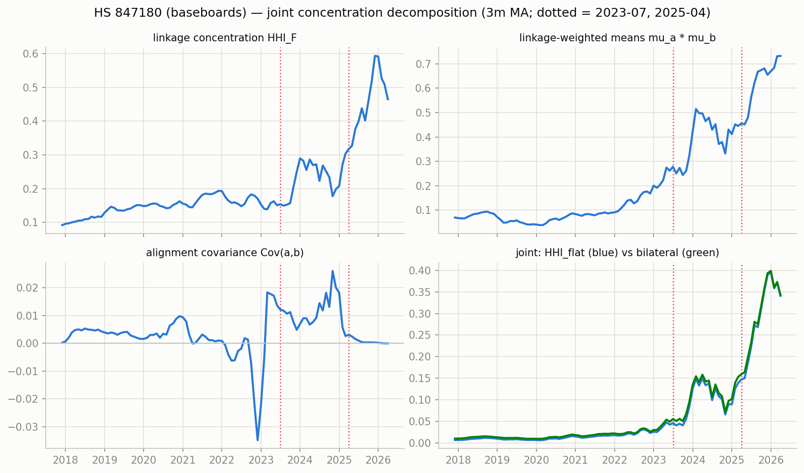
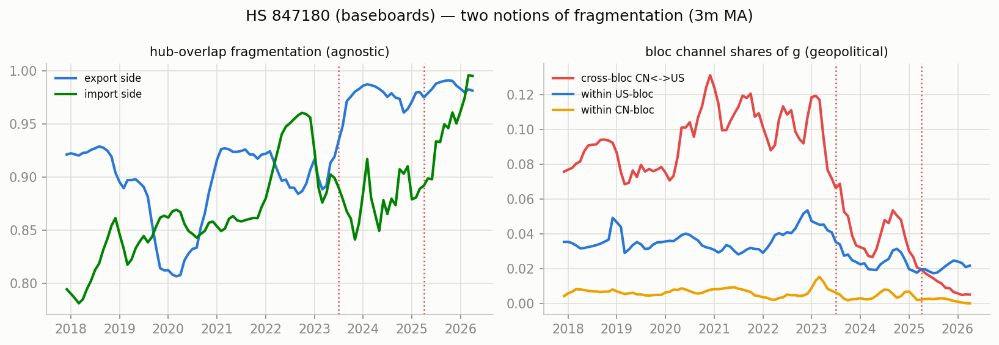
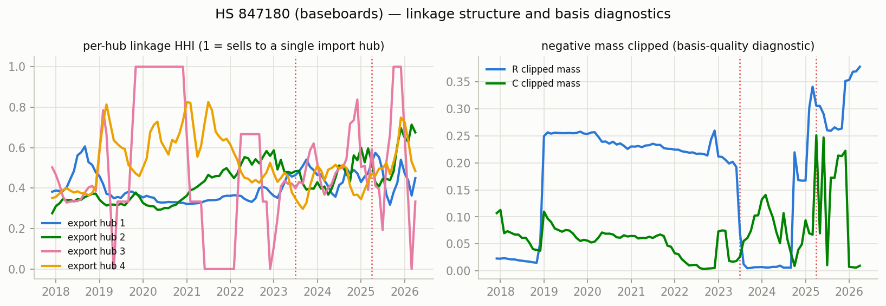

# Network concentration & fragmentation — HS 847180 (baseboards)

Measures per docs/concentration-fragmentation-nnf-mfm-trade.md, computed monthly from the era-anchored TV-MFM (CHN+HKG bloc, NNF basis, clipped shares). Full series in `series.csv`.

Coverage 2017-12 .. 2026-04 (101 months). Mean clipped negative mass: R 0.183, C 0.068 (max 0.378).

## Readings around the structural breaks (3m before vs 3m from the break)

### 2023-07 (H100 ramp)

| measure | before | after | change |
|---|---|---|---|
| hhi_F | 0.1505 | 0.1523 | +0.0018 |
| aligncov | 0.0136 | 0.0107 | -0.0030 |
| hhi_flat | 0.0421 | 0.0441 | +0.0020 |
| hhi_bilat | 0.0490 | 0.0556 | +0.0065 |
| frag_exp | 0.9192 | 0.9715 | +0.0522 |
| crossbloc_cnus | 0.0718 | 0.0527 | -0.0191 |
| within_us | 0.0409 | 0.0275 | -0.0134 |
| within_cn | 0.0073 | 0.0028 | -0.0045 |

### 2025-04 (tariffs)

| measure | before | after | change |
|---|---|---|---|
| hhi_F | 0.3034 | 0.3769 | +0.0735 |
| aligncov | 0.0026 | 0.0015 | -0.0011 |
| hhi_flat | 0.1388 | 0.1858 | +0.0470 |
| hhi_bilat | 0.1528 | 0.1990 | +0.0462 |
| frag_exp | 0.9799 | 0.9829 | +0.0030 |
| crossbloc_cnus | 0.0208 | 0.0159 | -0.0048 |
| within_us | 0.0177 | 0.0184 | +0.0007 |
| within_cn | 0.0021 | 0.0027 | +0.0006 |

## Figures

_Generated by `scripts/network_stats.py`._