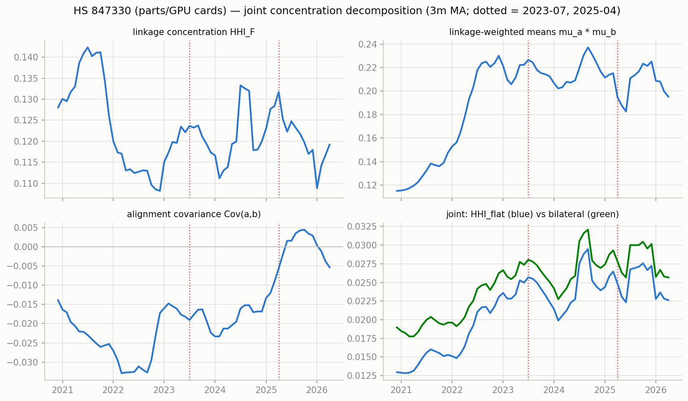
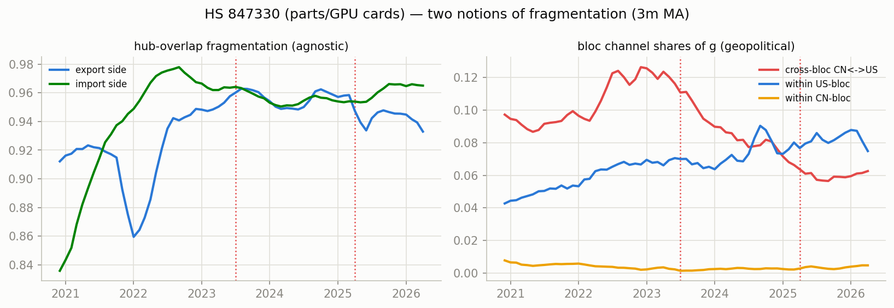
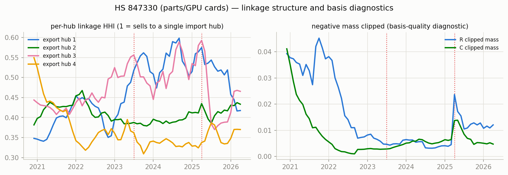

# Network concentration & fragmentation — HS 847330 (parts/GPU cards)

Measures per docs/concentration-fragmentation-nnf-mfm-trade.md, computed monthly from the era-anchored TV-MFM (CHN+HKG bloc, NNF basis, clipped shares). Full series in `series.csv`.

Coverage 2020-12 .. 2026-04 (65 months). Mean clipped negative mass: R 0.016, C 0.008 (max 0.045).

## Readings around the structural breaks (3m before vs 3m from the break)

### 2023-07 (H100 ramp)

| measure | before | after | change |
|---|---|---|---|
| hhi_F | 0.1221 | 0.1238 | +0.0016 |
| aligncov | -0.0182 | -0.0164 | +0.0018 |
| hhi_flat | 0.0250 | 0.0250 | +0.0000 |
| hhi_bilat | 0.0274 | 0.0273 | -0.0001 |
| frag_exp | 0.9576 | 0.9627 | +0.0051 |
| crossbloc_cnus | 0.1163 | 0.1059 | -0.0104 |
| within_us | 0.0705 | 0.0667 | -0.0038 |
| within_cn | 0.0022 | 0.0015 | -0.0008 |

### 2025-04 (tariffs)

| measure | before | after | change |
|---|---|---|---|
| hhi_F | 0.1284 | 0.1223 | -0.0061 |
| aligncov | -0.0092 | 0.0015 | +0.0107 |
| hhi_flat | 0.0265 | 0.0223 | -0.0041 |
| hhi_bilat | 0.0293 | 0.0257 | -0.0036 |
| frag_exp | 0.9584 | 0.9338 | -0.0246 |
| crossbloc_cnus | 0.0663 | 0.0614 | -0.0050 |
| within_us | 0.0801 | 0.0808 | +0.0007 |
| within_cn | 0.0021 | 0.0040 | +0.0019 |

## Figures

_Generated by `scripts/network_stats.py`._