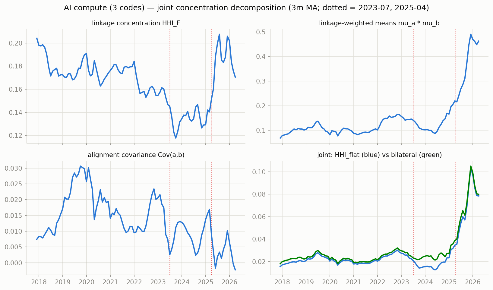
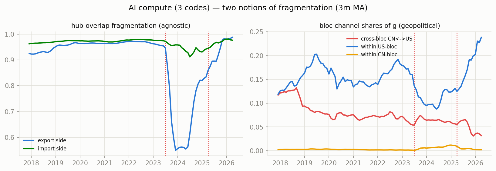
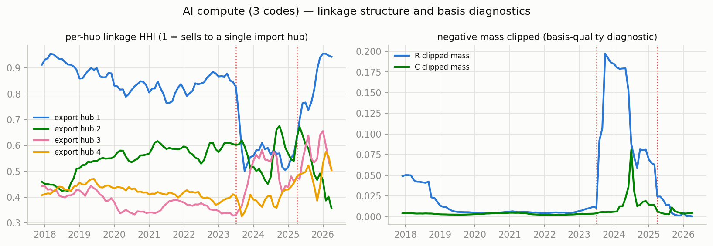

# Network concentration & fragmentation — AI compute (3 codes)

Measures per docs/concentration-fragmentation-nnf-mfm-trade.md, computed monthly from the era-anchored TV-MFM (CHN+HKG bloc, NNF basis, clipped shares). Full series in `series.csv`.

Coverage 2017-12 .. 2026-04 (101 months). Mean clipped negative mass: R 0.034, C 0.006 (max 0.197).

## Readings around the structural breaks (3m before vs 3m from the break)

### 2023-07 (H100 ramp)

| measure | before | after | change |
|---|---|---|---|
| hhi_F | 0.1467 | 0.1229 | -0.0238 |
| aligncov | 0.0074 | 0.0071 | -0.0003 |
| hhi_flat | 0.0224 | 0.0162 | -0.0063 |
| hhi_bilat | 0.0248 | 0.0217 | -0.0031 |
| frag_exp | 0.9545 | 0.7927 | -0.1618 |
| crossbloc_cnus | 0.0544 | 0.0696 | +0.0152 |
| within_us | 0.1598 | 0.1131 | -0.0466 |
| within_cn | 0.0013 | 0.0034 | +0.0021 |

### 2025-04 (tariffs)

| measure | before | after | change |
|---|---|---|---|
| hhi_F | 0.1403 | 0.1881 | +0.0478 |
| aligncov | 0.0169 | -0.0017 | -0.0186 |
| hhi_flat | 0.0317 | 0.0461 | +0.0144 |
| hhi_bilat | 0.0356 | 0.0509 | +0.0153 |
| frag_exp | 0.8341 | 0.8952 | +0.0611 |
| crossbloc_cnus | 0.0566 | 0.0629 | +0.0063 |
| within_us | 0.1309 | 0.1355 | +0.0045 |
| within_cn | 0.0113 | 0.0039 | -0.0073 |

## Figures

_Generated by `scripts/network_stats.py`._